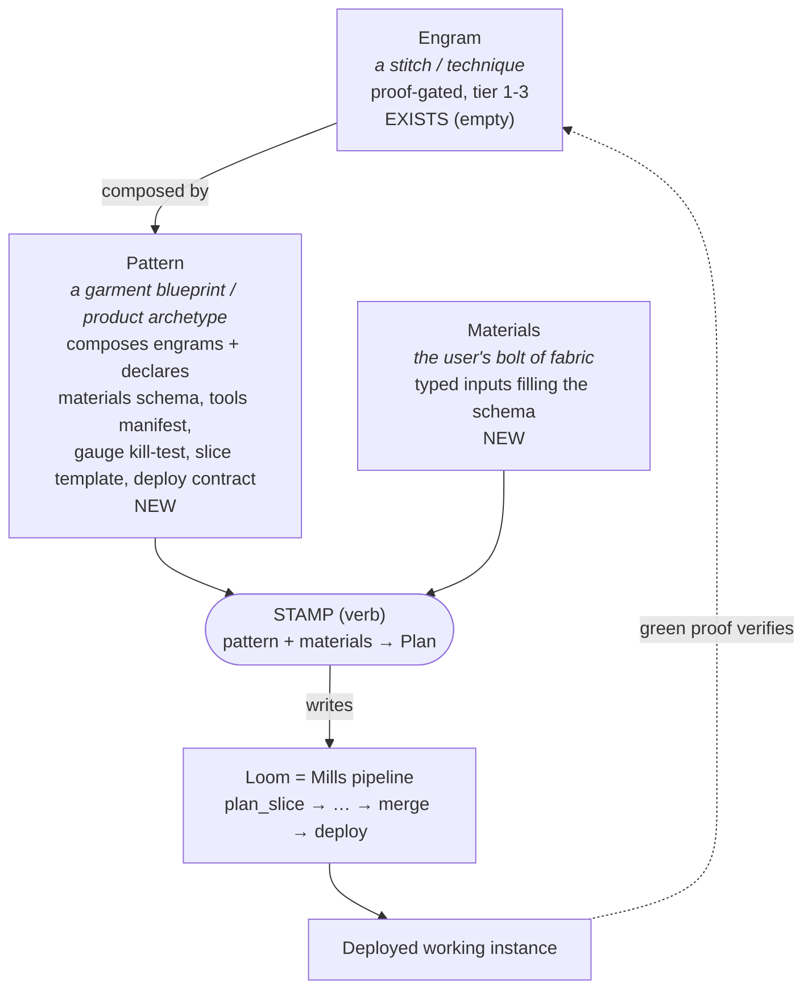

# Brainstorm: Mills as a Pattern Loom

**Date**: 2026-06-28
**Status**: Brainstorm → spec bridge (pre-slice). Riskiest assumption **not run**.
**Author**: Cody + Claude (plan-loom-core)
**Thread**: builds on engrams ([77](77-research-agentic-engineering-patterns-2026-04-05.md), [78](78-plan-dark-factory-patterns-2026-04-05.md)), Mills vision ([126](126-plan-mills-full-vision-roadmap-2026-06-01.md)), Plan Store ([160](160-product-spec-loom-plan-store-2026-06-20.md)), and the demand-sourcing program (`.loom/163`, memory-only).

---

## The metaphor

A **textile pattern** is an instruction book to produce a thing. Anyone can produce that thing if they have (a) **materials**, (b) **basic tools**, and (c) the ability to **follow instructions**. The pattern encodes a master's accumulated taste; the follower needs none of their own.

The bet: this is exactly where Mills should go. A user arrives with **intent to make a thing** (a product, service, or tool). Mills holds a **library of patterns** proven to work for that *type* of thing. Mills **stamps** the chosen pattern with the user's **materials** (details, requirements) and hands back a **deployed, working version**.

Two applications fall out of one metaphor:

1. **Patterns as constraint (taste rails, inward-facing).** Even on Mills' existing autonomous loop, route every proposal through the pattern library so generated architecture conforms to approved templates instead of free-styling. Quality + consistency, now.
2. **Patterns as entrypoint (intent→product, outward-facing).** A human brings materials; Mills stamps a pattern and deploys. This is the *inversion* of Mills' "no human touch" identity — the human returns as a **demand source**, not a supervisor.

---

## What already exists (so we don't reinvent)

| Building block | Status | Source |
|---|---|---|
| **Engram** — proof-gated, prerequisite-aware code pattern (`engram://family/slug`, tiers 1–3, `agent_engram_verify`) | Real engine, **empty catalog**. No producer, no seed, no Mills/council consumer. | `pkg/agentcontext/svc_engrams.go`, `engram_verify.go`, `engram_graph.go`; HUD summary `internal/hud/api_engrams.go:27` |
| **Council brief → sliced proposals** — assembles intent from roadmap/KPIs/alerts, editor emits artifacts + `BacklogProposal`s | Shipped; **autonomous** (invents demand, opposite of user-supplied materials) | `pkg/mills/council/brief.go:80`, `council/editor.go:18`, `council/backlog_mutator.go:138` |
| **Council Editor interface** — drop-in (FlexInfer + gpt-5.4), `brief+reviews → EditorOutput` | Shipped; the natural **stamping seam** | `council/editor.go:18`, `clients/council.go:60`, `clients/council_openai.go:30` (!824) |
| **Squads manifest** — path-glob → templates/tests/gates/ensemble, hot-reloaded | Shipped; closest existing **pattern-library primitive** | `pkg/mills/squads/types.go:40`, `squads/router.go:103` |
| **Plan Store** — durable, worktree-resilient `Plan`+`PlanSlice` (Qdrant), brief→slices→deploy lifecycle | Shipped; the **instance substrate**. Council write-path **S7b deferred** | `pkg/agentcontext/schema_plan.go:98`; spec [160](160-product-spec-loom-plan-store-2026-06-20.md) |
| **Scaffold skills** — `go-service-scaffold`, `loom-go-mcp-scaffold` | Shipped as **prose patterns** — hand-written "make this type of thing, wire build, regen/sync" | `mcp/context/skills-registry.yaml` |
| **Pipeline** — `plan_slice→research→implement→gates→tests→review→mr→ci_watch→merge→cleanup` | Shipped; A2 (first unattended merge) PASSED 2026-06-24 | `pkg/mills/pipeline/runner.go:55` |

**Genuinely new** (the unbuilt triangle): user-supplied *materials* (not synthesized signals); *stamping* as a first-class verb (`pattern + materials → instance`); a *human entrypoint* to Mills; and a pattern's *required-tools manifest* as a closed declared set.

---

## Object model (proposed)

Three nouns and one verb. Layered from atom to machine.

- **Engram** (exists, empty) — the atomic *technique*. "We know this stitch works." Already proof-gated and verifiable; just needs a producer.
- **Pattern** (new) — the *product archetype*. The textile pattern proper. It declares:
  - **Type / what it makes**: "Go MCP server", "Go REST microservice", "CLI tool", "Svelte HUD page".
  - **Materials schema**: typed parametric inputs the user supplies (name, entities/fields, endpoints, auth, storage, deploy target). The "X yards, color of your choice."
  - **Tools manifest**: the closed set of *basic tools* required — MCP servers, build toolchain, deploy target, secrets. If the environment lacks one, the pattern **cannot be stamped** — fail fast, loud.
  - **Gauge / swatch = kill-test**: a tiny end-to-end stamp that proves the pattern produces a correct result *in this environment* before committing to the full build. This is the workspace's own riskiest-assumption discipline, embedded as a pattern artifact.
  - **Slice template**: the deterministic decomposition into `PlanSlice`s (composes engrams + scaffold steps).
  - **Deploy contract**: what "deployed working version" means for this type (health-checking pod / published binary / merged MR + green CI).
  - **Provenance + taste gate**: who approved it; proof that N instances shipped green. The "we approve / find tasteful" layer — patterns are themselves proof-gated, like engrams.
- **Materials** (new) — the concrete inputs filling a Pattern's schema.
- **Stamp** (new verb) — `stamp(pattern_id, materials) → Plan` → Mills executes → deployed instance. The missing production operation.

**Loom = Mills.** Today it generates its own demand; the Pattern Loom adds an intent front door that feeds the *same* pipeline through a pattern-constrained path.

---

## Riskiest assumption + kill-test

**Load-bearing assumption**: A vetted Pattern, given a typed materials bundle, can be **deterministically stamped into a Plan that Mills' existing pipeline executes to a green, deployed result — with zero per-instance human architecture decisions** between materials submission and merge. (If each instance still needs human judgment, it is not a pattern; it is a suggestion, and the abstraction collapses back into today's council.)

**Kill test** (≤1 pipeline run, ~30–60 min): Formalize **one** existing prose pattern — `loom-go-mcp-scaffold` — as a `Pattern` object with materials schema + tools manifest + a gauge test. Supply **synthetic materials** (a trivial MCP server: a name + one tool). Run `stamp()` → Mills pipeline (`plan_slice→implement→tests→mr→ci_watch→merge`) with **no human input** after materials. **Observable pass**: a green merged MR whose new server **builds and passes its own gauge test in CI**.

**Failure mode if wrong**: we build a materials-intake UI + pattern catalog that still dumps into a human-in-the-loop council — i.e. today's manual REST intake (`pkg/mills/handlers_backlog.go:48`) with extra ceremony, and the "anyone can follow it" promise is false.

**Pair with negative search** before declaring pass: does Mills' spawn/implement stage actually honor a fully-specified slice without re-deciding architecture? Cite both a green stamp AND an inspection of the generated diff for unrequested architectural choices.

**Status**: not run.

---

## Phased slices (proposed)

| Slice | Goal | Proves / unlocks | Attach point |
|---|---|---|---|
| **S0** | `Pattern` schema + catalog; seed ONE pattern (loom-go-mcp formalized) | A pattern is a queryable, cross-agent artifact | New agent-context entity (mirror Plan/Engram) **‹rec›** |
| **S1** | `stamp(pattern, materials)→Plan`; run the **gauge kill-test** | **The riskiest assumption.** BLOCKS S2–S5 | Plan Store write-path (deferred S7b) |
| **S2** | Pattern-constrained Council Editor (value prop **A**) | Quality rails on the existing autonomous loop; pattern-stamp demand for canary autopilot | `council/editor.go:18` / `clients/council.go:131` |
| **S3** | Populate engrams from green stamps | Fuels the empty engram engine; `unlocked_in` tracks proven repos | `svc_engrams.go` + `agent_engram_verify` |
| **S4** | Materials intake front door (value prop **B**) | The human entrypoint: pick pattern → fill materials → see gauge → deploy | HUD page / `loom mills stamp` CLI |
| **S5** | Pattern authoring + taste gate | How new patterns are added/approved/promoted (provenance, N-green) | Pattern proof contract |

**Sequencing rationale**: S1 is the cheap, decisive kill-test — run it before building any front door. S2 delivers value on the *existing* loop (no new surface) and feeds idle canary-autopilot demand. S4 (the headline "user enters Mills") only earns its cost after S1 proves stamping is real.

---

## Decisions (resolved 2026-06-28)

1. **Emphasis** → **Both as parallel tracks after S1.** S0+S1 (catalog + the gauge kill-test) are the shared trunk; once S1 proves stamping reaches green, **Track A** (constraint rails on the autonomous loop) and **Track B** (human intent front door) proceed concurrently.
2. **First pattern type** → **Go REST microservice** (`go-service-scaffold` formalized). HTTP endpoints + K8s manifests + CI; realistic as a "product" a user would request; gauge = builds + generated CRUD/`/healthz` smoke test passes in CI.
3. **Pattern storage** → **new agent-context entity** (`agent_patterns_v1`), mirroring Plan/Engram: cross-agent, worktree-resilient, queryable by `pattern_id`. A thin projection into Mills policy handles matching/labelling.

The executable slice plan lives in the Plan Store (rendered mirror: `165-plan-pattern-loom-mills-2026-06-28.md`). This doc remains the free-form rationale.

---

## Sources

- Engram engine + emptiness: `pkg/agentcontext/svc_engrams.go`, `engram_verify.go:95`, `engram_graph.go:14`; CHANGELOG seed deferral.
- Mills pipeline + council + squads: `pkg/mills/pipeline/runner.go:55`, `council/editor.go:18`, `council/brief.go:80`, `squads/router.go:103`, `reconciler.go:194`.
- Plan Store: `pkg/agentcontext/schema_plan.go:98`; spec [160](160-product-spec-loom-plan-store-2026-06-20.md).
- Prior art: [77](77-research-agentic-engineering-patterns-2026-04-05.md), [78](78-plan-dark-factory-patterns-2026-04-05.md), [126](126-plan-mills-full-vision-roadmap-2026-06-01.md); flexdeck engram example `services/flexdeck/.loom/engram-and-skill-encoding-flexdeck-experience-2026-05-10.md`.
