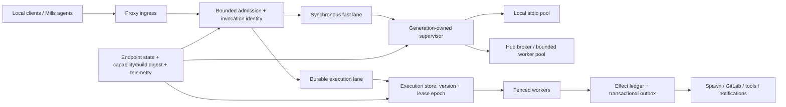

# Research — Loom Core Fleet Performance and Reliability Architecture

- **Date**: 2026-07-10
- **Scope**: Go backend (`loomd`, proxy, MCP transports/servers, Mills runtime,
  persistence, health, telemetry, and CI)
- **Method**: current source inspection, Loom runtime inventory, live local
  health/metrics/log evidence, three independent read-only audits, and primary
  external specifications
- **Status**: complete; feeds canonical plan

## Executive finding

Loom does not need a wholesale rewrite. It needs three explicit contracts that
the current implementation only has in fragments:

1. **Ownership contract** — exactly one component owns each physical transport,
   server process, notification loop, and generation transition.
2. **Execution contract** — every admitted operation has bounded resources,
   stable identity, explicit replay semantics, and (when durable) atomic state,
   leases/fencing, and an effect ledger/outbox.
3. **Evidence contract** — route readiness, build/capability identity, telemetry,
   tests, and benchmark gates describe what can actually serve a call, not what
   was merely configured or probed.

The recommended design is a **two-lane reliability kernel**:

- Keep ordinary local MCP calls on a synchronous, zero-durable-write fast lane.
- Route explicitly long-running or mutation-heavy work through a durable
  execution lane shared conceptually by Mills, spawns, and future MCP Tasks.
- Share admission, operation identity, generation ownership, health, and
  capability contracts between both lanes.

This preserves the reason Loom feels good locally while removing the ambiguous
ownership and crash gaps that become fleet-wide failure amplifiers.

## Questions investigated

1. What currently limits performance and reliability for local agents?
2. Which failure modes become unsafe as Mills concurrency grows?
3. What should remain local and synchronous?
4. Which capabilities belong in a durable execution substrate?
5. What proof is missing from CI, health, and observability?
6. How should Loom prepare for evolving MCP task semantics without coupling its
   storage model to one protocol revision?

## Facts found

### 1. The planning run reproduced a control-plane outage

The active Loom profile exposed 25 servers and 317 tools with 12 proxy sessions.
During this planning pass:

- `agent_plan_create` and `agent_plan_list` first failed with local
  `muxstdio: transport closed` plus hub connection reset/timeout errors.
- A later list failed with `pool exhausted for agent_context: max open
  connections reached (max_open=25, waited 5s)`.
- `loom://health` showed the `agent_context` monitor healthy while both local
  and hub route states were unhealthy.
- `curl http://127.0.0.1:9876/health` still returned top-level `healthy`.
- The daemon log showed the same closed hub socket cascading across session,
  presence, task, plan, memory, graph, workflow, and HUD monitor calls within
  seconds.
- The route later recovered without a daemon restart, then failed again on the
  next plan creation response.

This is a direct counterexample to treating process/probe health as call
readiness. It also shows why control traffic needs a reserved lane and shared
circuit state: failed heartbeats and monitors currently amplify the outage.

Reproducible command evidence is indexed in `.loom/00-mcp-inventory.md`.

### 2. Hub transport ownership is internally contradictory (P0)

The pinned `mcp-go` contract says every `WebSocketClient.Dial` returns a fresh,
independently owned WebSocket (`../../libs/mcp-go/websocket.go:477-500`). Loom's
hub pool then passes each fresh socket to a cache keyed only by server name
(`internal/daemon/daemon_new.go:243-265`). On a cache hit,
`muxCache.GetOrCreate` returns the first mux and ignores the newly opened inner
transport (`internal/daemon/muxcache.go:49-63`). The pool wrapper's `Close` is a
no-op (`internal/daemon/muxcache.go:187`).

Hub failure handling clears the logical pool and `WebSocketClient`'s separate
cache, but never evicts `hubMuxCache`
(`internal/daemon/callpipeline_routing.go:319-359`,
`internal/daemon/callpipeline_errors.go:145-159`). The hub mux is otherwise
closed only during daemon shutdown (`internal/daemon/daemon_lifecycle.go:309-317`).

Likely consequences, all consistent with the live incident:

- later fresh sockets and their keepalive goroutines can be leaked;
- logical pool connections continue sharing the first mux despite code comments
  assuming independent sockets;
- a closed cached mux can survive pool clearing and be handed to reconnections;
- capacity eventually presents as pool exhaustion rather than a clean circuit
  open/recovery transition.

The immediate correction should follow the already-selected `mcp-go` contract:
remove the hub mux/per-connection shim from the fresh-`Dial` pool path and let
the pool own each WebSocket. A future shared hub broker is a separate topology
change and must not be smuggled into the pool through a second cache.

### 3. Server/process generations and retries are not safe enough

Server state and muxes are keyed by server name rather than by a monotonic
generation (`internal/daemon/daemon.go:124`, `internal/daemon/muxcache.go:33`).
A delayed error from an old call can clear or stop the current server by name
(`internal/daemon/callpipeline_errors.go:115-131`,
`internal/daemon/callpipeline_routing.go:126-134`). Default mux-mode calls do
not hold the lock that the idle reaper treats as its in-flight signal
(`internal/daemon/callpipeline_routing.go:155-173,237-260`,
`internal/daemon/daemon_loops.go:58`).

The proxy and daemon also replay transport-failed `tools/call` requests without
an end-to-end invocation ID or effect classification
(`cmd/loom/proxy.go:443`, `cmd/loom/proxy_transport.go:212,315`,
`internal/daemon/callpipeline_routing.go:319-359`). If a mutation committed and
only its response was lost, a retry can duplicate the effect.

The required primitives are a generation-scoped supervisor, active-call leases,
singleflight replacement, operation identity, and explicit `read_only`,
`idempotent`, `mutating`, and `durable` behavior. An ambiguous mutation outcome
must be deduplicated or returned as such; it must not be blindly replayed.

### 4. Admission is bounded in pieces, not as a fleet policy

Per-server pools are bounded, but global concurrent calls default to unlimited
(`internal/daemon/config.go:339,589`). Every accepted Unix connection creates
multiple goroutines and subscriptions without a connection cap
(`internal/daemon/daemon_transport.go:15-67`). There is no weighted global /
per-server / per-agent queue or reserved control lane. Session capacity eviction
can remove the oldest active session (`internal/daemon/session.go:285`).

Mills similarly enforces some budgets and per-parent fanout limits, but not one
atomic fleet reservation:

- budget admission is read-then-decide (`pkg/mills/budget.go:46-166`);
- failed-stage cost can be omitted from the run rollup
  (`pkg/mills/pipeline/runner.go:895-929`);
- fanout semaphores are per parent rather than fleet-wide
  (`pkg/mills/pipeline/integrator.go:208-238,324-329`);
- priority bands can starve low-priority work (`pkg/mills/ranker.go:10-84`).

Admission must become an explicit state transition with bounded waiting,
structured overload, fairness/aging, and atomic reservations for money, turns,
wall time, spawn slots, CPU, and memory.

### 5. Mills has a strong base, but its core start transition is not atomic

Current strengths:

- a canonical SQLite store with WAL, foreign keys, busy timeout, and typed DAOs
  (`pkg/mills/store/store.go:1-7,73-125`);
- deterministic workflow spawn keys and resume behavior
  (`pkg/mills/workflow/runtime.go:181-254`);
- a durable workflow step journal and deployed crash kill-test harness;
- single-replica operation is an explicit choice, not accidental
  (`pkg/mills/scheduler.go:33-36`).

However, the reconciler's key transition is a read-check-write sequence. It
creates the run and then updates the backlog with two independent DAO calls
(`pkg/mills/reconciler.go:746-781`). The comment says the state belongs to one
transaction, but no transaction exists; the error-path "rollback" at line 779
only takes a method value and does nothing. Run IDs have one-second resolution,
and full-row upserts carry no expected version/fencing token
(`pkg/mills/store/dao_backlog.go:24-100`,
`pkg/mills/store/dao_pipeline.go:22-85`).

Workflow journal creation has a related invariant gap: `ensureRun` can upsert
and clobber pre-created immutable run metadata
(`pkg/mills/workflow/journal_dao.go:137-158`,
`pkg/mills/store/dao_workflow.go:47-96`). Concurrent step append is
read-decide-write rather than claim/CAS (`pkg/mills/store/dao_workflow.go:354-447`).

Before adding replicas, Loom should introduce a transactional transition kernel:

- monotonic aggregate version;
- conditional allowed-state transitions;
- `ClaimNext` transaction covering backlog claim, attempt allocation, run
  creation, budget reservation, and transition record;
- UUID/ULID run IDs;
- immutable-field validation;
- durable dispatch intent/outbox consumed after commit.

### 6. Mills lacks general leases, fencing, and effect reconciliation

Pipeline/workflow ownership is process-local. There is no durable lease owner,
lease epoch, fencing token, or transactional outbox. Idempotency is strong for
some spawn paths but not general for MR creation, merge, notifications, issue
closure, or evaluation. Crashes between an external effect and state persistence
can repeat the effect (`pkg/mills/pipeline/runner.go:795-934,1305-1342`).

The durable lane therefore needs a protocol-neutral Execution record and an
effect ledger:

- execution ID, kind, target, command/request hash, auth scope;
- desired/current state, version, deadline, retention;
- lease owner, epoch, expiry, heartbeat;
- immutable terminal result/error;
- resource reservation linkage;
- effect intent/status/external resource ID;
- transactional outbox and dead-letter state.

SQLite remains the right embedded/local backend. A clustered backend (likely
Postgres) should be added only after the same contract passes the fencing and
effect-adoption kill tests. Kubernetes Leases are suitable for singleton/leader
coordination, but per-execution fencing still belongs in the execution store.

### 7. Hub server topology scales child processes with clients

`cmd/custom-server` starts an MCP child for each SSE session and each WebSocket
(`cmd/custom-server/main.go:222,530`). Readiness only reflects drain state, and
there is no child-process cap or per-wrapper metrics
(`cmd/custom-server/main.go:514`). Stateful servers such as agent-context start
background services in every process (`cmd/mcp-agent-context/main.go:86-92`).

After transport ownership is fixed, the fleet topology should move to a
supervised bounded worker pool or shared child/broker so client connection count
does not equal server process/background-service count. Singleton maintenance
work must be separately elected or disabled in non-owner workers.

### 8. Health, build identity, and telemetry overstate certainty

Health is split between router and monitor stores. Divergence is reported but
not reconciled; `healthyThreshold` is configured but a single success restores
health (`internal/daemon/health.go:34,361,501`). Restart handling sleeps while
holding the health mutex and every sweep launches a goroutine per server
(`internal/daemon/health.go:217,282,484`).

The running `loomd` was built from `37296ea9` (2026-07-06) and the running
agent-context binary from `25a773f8` (2026-06-27), while the inspected checkout
was `6aae2f63` (2026-07-10 EDT). Agent-context advertises a static `1.0.0`
(`cmd/mcp-agent-context/main.go:19`), and the live config exposed empty manifest
and registry hashes. The live tool schema was correspondingly older than source.

Telemetry is broad but not yet truthful enough to gate reliability:

- OTel is initialized in two places (`cmd/loomd/main.go:72`,
  `internal/daemon/daemon_new.go:87`);
- runtime metric status can report enabled without an exporting meter provider
  (`internal/daemon/daemon_dispatch_otel.go:169`);
- hub latency records a zero-valued local duration
  (`internal/daemon/daemon_loops.go:208`);
- event-drop collection adds zero instead of the EventBus delta
  (`internal/daemon/daemon_loops.go:240`);
- an `agent_id` metric attribute risks fleet-cardinality growth
  (`internal/daemon/otel_metrics.go:69`).

The target is one immutable Endpoint/Generation state store and one telemetry
lifecycle owner. Every health/trace/benchmark artifact must include build SHA,
dirty bit, startup/epoch ID, config digest, tool-schema digest, and route target.

### 9. Branch CI can currently miss the core regressions

- The unit package filter excludes every `pkg/...` package, not only the
  dependency-linked subset described by its comment (`.gitlab-ci.yml:555-562`).
- Broad race coverage is restricted to the default branch
  (`.gitlab-ci.yml:643-699`).
- The integration job sets `LOOM_RUN_MCP_SMOKE`, while the daemon/proxy chaos
  tests require `LOOM_RUN_INTEGRATION`; those tests therefore skip
  (`.gitlab-ci.yml:619-630`, `internal/integration/proxy_daemon_test.go:18-23`).
- The benchmark job is non-blocking and does not compare against a baseline
  (`.gitlab-ci.yml:701-717`).
- There are no Go fuzz targets for protocol/config framing.

This explains how a cross-repo ownership contract change can pass isolated
tests yet leave a live closed-mux/pool-exhaustion failure. A hermetic fake-hub
and crash-point gauntlet is an architecture prerequisite, not cleanup work.

### 10. Protocol modernization should follow, not define, the execution kernel

The Go backend negotiates only MCP `2024-11-05` and `2025-06-18`
(`../../libs/mcp-go/types.go:29-33`,
`internal/daemon/daemon_dispatch.go:144-164`,
`cmd/loom/proxy_handlers.go:31-50`). Mills' MCP hub client still initializes as
`2024-11-05` (`pkg/mills/clients/mcphub.go:296`). The backend exposes no durable
MCP task dispatch.

The 2025-11-25 core Tasks feature is explicitly experimental. Finalized
SEP-2663 subsequently moves Tasks into the `io.modelcontextprotocol/tasks`
extension and changes negotiation/result methods; the designs are not wire
compatible. Crucially, the extension requires durable task creation before the
server returns the task handle.

Therefore:

- do not encode a particular MCP Task schema into the execution store;
- keep agent-context TODO tasks, Mills domain state, and durable MCP invocation
  handles as separate concepts;
- add versioned protocol adapters after the Execution contract passes local and
  clustered crash tests;
- preserve direct synchronous behavior for clients/calls that do not negotiate
  the extension.

## Options considered

| Option | Benefit | Failure / tradeoff | Verdict |
|---|---|---|---|
| Patch only the hub cache | Fast relief for today's outage | Leaves ABA generations, unsafe mutation replay, Mills crash gaps, and weak CI | Necessary first slice, insufficient architecture |
| Route every call through one durable control plane | Uniform semantics | Adds storage latency/failure to fast local reads; over-centralizes a local tool runtime | Reject |
| Two lanes over shared contracts | Preserves local speed; adds durability only where needed; common health/admission/identity | Requires careful classification and two conformance suites | **Recommend** |

## Recommended target architecture

### Shared contracts

1. **Generation ownership**: `(server, target, generation)` owns one transport
   topology, active-call lease count, notification consumer, and close path.
2. **Invocation identity**: stable ID + request hash + effect classification
   survives proxy/daemon/hub hops.
3. **Admission**: bounded global/server/agent queues; reserved control lane;
   fairness/aging; structured `retry_after` overload.
4. **Endpoint truth**: one immutable state model fed by real calls and probes;
   liveness, readiness, dependency degradation, and circuit state are distinct.
5. **Capability truth**: build/config/schema/protocol digests travel in init,
   health, traces, and benchmark artifacts.

### Fast lane

- Default for ordinary local calls.
- No execution-store write.
- Only safe/idempotent operations are automatically replayable.
- Mutations require a dedupe key or return an ambiguous-outcome error after an
  uncertain transport failure.
- Same admission, generation, health, and telemetry contracts as the durable
  lane.

### Durable lane

- Opt-in/required for long-running, resumable, or effect-heavy work.
- Atomic claim + reservation + transition + dispatch intent.
- Leases and fencing protect worker ownership; lease TTL is not task retention
  or runtime deadline.
- Effect ledger adopts resources after uncertain outcomes.
- Transactional outbox delivers notifications/audit/evaluation after commit.
- Protocol adapters project the record to Mills, spawn, CLI/HUD, and negotiated
  MCP Task shapes.

## Initial SLOs and kill thresholds

These are starting budgets; recalibrate after seven days of representative
fleet measurements.

| Surface | Initial target |
|---|---|
| local warm proxy overhead | p50 <=10 ms, p95 <=25 ms, p99 <=75 ms at 100 callers |
| cold local initialization | p95 <=1 s, p99 <=3 s excluding auth |
| forced local/hub transport close | recovery p99 <=5 s; no daemon restart or permanent wedge |
| synthetic hub no-op | >=99.9% success; p95 <=250 ms, p99 <=1 s |
| 25-client 30-minute soak | >=99.9% success; zero misroutes/deadlocks; post-GC RSS growth <10% |
| reconnect resource bound | after 100 cycles, <=+5 goroutines and <=+5 MiB post-GC |
| overload | reject in <100 ms with `retry_after`; queues never exceed configured cap |
| Mills claim | 100 racers produce one run, one lease epoch, one dispatch intent |
| Mills crash recovery | no duplicate spawn/MR/merge; resume within scheduler interval +30 s |
| queued claim at 10k items | p95 <100 ms and <20 SQL statements per tick |
| branch performance gate | block >10% latency/time, >15% allocations, or >5% sustained resource growth |

## Core agent workflow packs

### Research loop

1. Read build/capability digest and route readiness.
2. Use the local index when populated and embedding service is healthy.
3. Automatically degrade to lexical index/`rg` on embedding overload (this
   session's semantic queries returned Morph 429).
4. Preserve exact command/source evidence in the context pack.

### Technical writing loop

1. Store the canonical plan/spec before rendering a mirror.
2. Include build/config/schema identity in the plan evidence block.
3. Record facts, assumptions, open questions, and kill-test status separately.
4. If the plan store is unavailable, retain the failed route evidence and retry;
   do not silently present a hand-edited mirror as canonical.

### Testing and ship loop

1. Required branch gate under ten minutes: fmt/vet/lint, hermetic core tests,
   contracts/OpenAPI, targeted race, fake-hub close/reconnect/leak test, and a
   60-second mixed-load test.
2. Nightly: repeated race, protocol/config fuzzing, median-of-ten benchmarks,
   30-minute soak, SQLite/dependency/telemetry fault matrix.
3. Canary: exact build SHA, synthetic local/hub calls, periodic socket/child/pod
   kills, OTLP outage, and automatic rollback on SLO burn.

### Troubleshooting loop

1. Capture one diagnostic bundle: generation IDs, route/circuit state, pool and
   queue depth, active leases, build/config/schema digests, goroutines/heap, and
   recent correlated traces.
2. Separate endpoint readiness from process liveness and dependency health.
3. Quiesce one failing generation; do not restart unrelated servers.
4. Hand off the exact invocation/execution IDs and ambiguous-effect state.

### Coordination loop

1. Plans remain stable cross-worktree IDs.
2. Agent TODOs remain distinct from durable execution records.
3. Every dispatched slice/execution carries plan ID, invocation ID, auth scope,
   resource reservation, and owner epoch.
4. Presence/heartbeat traffic uses the reserved control lane and shared circuit,
   preventing a failure storm from starving recovery calls.

## Assumptions

- Ordinary local calls must remain synchronous and storage-free by default.
- SQLite remains the embedded/single-owner store through the first crash-safe
  execution implementation.
- Multi-replica Mills is not enabled until fencing and effect-adoption pass.
- Current mcp-go fresh-per-`Dial` behavior is the immediate hub contract.
- External effects cannot be made literally exactly-once; Loom can provide
  effectively-once behavior through stable identity, adoption, and fencing.

## Open questions to resolve with kill tests

1. Does independent-socket hub pooling remain resource-efficient at the target
   client count, or does the later broker slice need one shared child earlier?
2. Which tool effects can be classified centrally versus declared in registry
   metadata?
3. Is Postgres already justified for deployed Mills HA, or should leader-elected
   singleton operation remain the supported fleet mode for another cycle?
4. Which active clients will negotiate the finalized Tasks extension, and is a
   legacy 2025-11-25 adapter actually needed?
5. What seven-day baseline should replace the provisional SLO thresholds?

## External validation

- MCP 2025-11-25 Tasks (experimental durable state machines):
  https://modelcontextprotocol.io/specification/2025-11-25/basic/utilities/tasks
- Final SEP-2663 Tasks extension (changed, non-wire-compatible task model):
  https://modelcontextprotocol.io/seps/2663-tasks-extension
- MCP transport disconnect semantics (disconnect is not cancellation):
  https://modelcontextprotocol.io/specification/2025-11-25/basic/transports
- SQLite transaction modes / `BEGIN IMMEDIATE`:
  https://www.sqlite.org/lang_transaction.html
- Kubernetes Lease coordination for workload leaders:
  https://kubernetes.io/docs/concepts/architecture/leases/
- Go diagnostics (pprof, tracing, runtime statistics):
  https://go.dev/doc/diagnostics
- OpenTelemetry RPC semantic conventions:
  https://opentelemetry.io/docs/specs/semconv/rpc/

Accessed 2026-07-10.

## Repository evidence index

- `.loom/00-mcp-inventory.md`
- `.loom/149-plan-backend-hub-transport-stability-2026-06-12.md:78-103`
- `.loom/157-iteration-plan-mcpgo-transport-durability-2026-06-17.md`
- `.loom/134-plan-mills-workflow-runtime-sequencing-2026-06-06.md`
- `.loom/170-plan-mills-cross-repo-execution-keystone-2026-07-05.md`
- `internal/daemon/daemon_new.go:230-267`
- `internal/daemon/muxcache.go:24-97,99-187`
- `internal/daemon/callpipeline_routing.go:143-173,237-270,319-359`
- `internal/daemon/callpipeline_errors.go:115-159`
- `internal/daemon/health.go:217-282,361,484-501`
- `cmd/custom-server/main.go:222,514,530`
- `pkg/mills/store/store.go:1-7,73-125`
- `pkg/mills/reconciler.go:150-220,746-802`
- `pkg/mills/workflow/journal_dao.go:137-158`
- `pkg/mills/store/dao_workflow.go:47-96,354-447`
- `pkg/mills/pipeline/runner.go:795-934,1305-1342`
- `.gitlab-ci.yml:555-562,619-630,643-717`
- `internal/integration/proxy_daemon_test.go:18-23`
- `../../libs/mcp-go/types.go:29-33`
- `../../libs/mcp-go/websocket.go:477-500`
