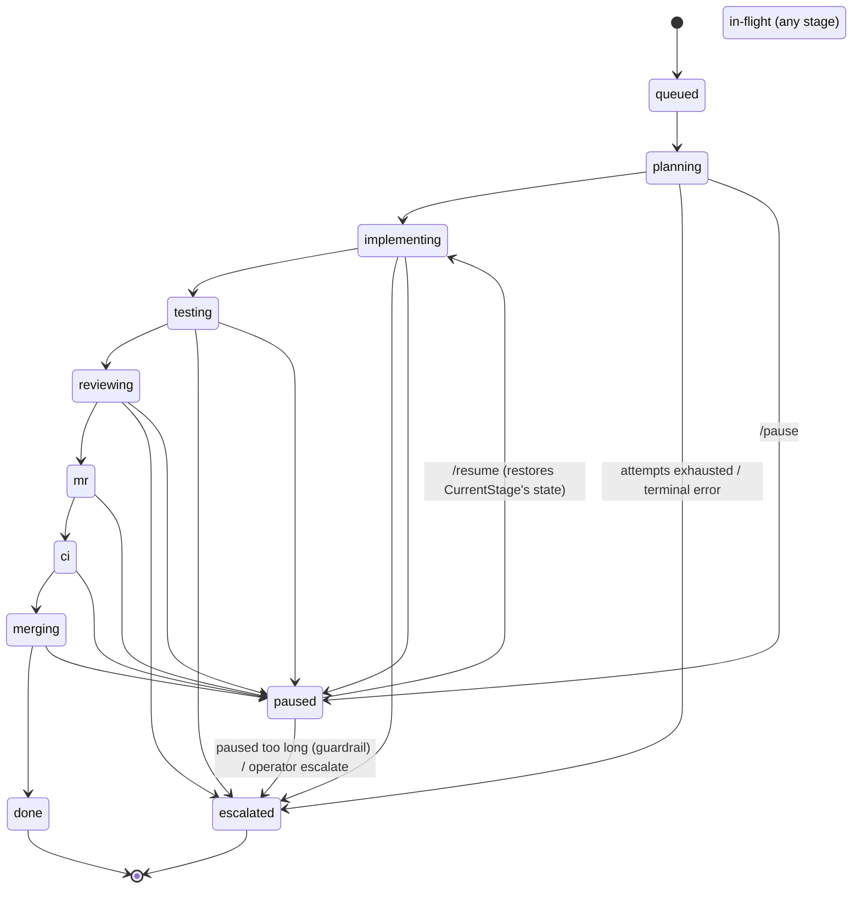

# Mills pipeline pause / resume — proper model

**Status**: design (2026-07-05). Supersedes the "4.x pipeline runner"
placeholder in `cmd/loom-mills-operator/handlers_pipeline.go:189-195`.

## TL;DR

Pause/resume is **not** a runner rebuild. The resumable substrate already
exists and is exercised on every operator restart:

- `PipelinePaused` / `BacklogPaused` states are defined
  (`pkg/mills/store/types.go:146`, `:13`).
- The runner re-reads persisted state before **and** after each stage and
  bails cleanly when it goes terminal — and `runTerminatedExternally`
  **already lists `PipelinePaused`** (`runner.go:464`, `:810`, `:1004-1012`).
  Its own comment names "pause kill-switch" as the motivating case.
- Progress is checkpointed per stage in `stage_results` + the
  `pipeline_runs.current_stage` cursor; `Drive` resumes from there
  (`runner.go:392-601`, `resumeIndex` `:606`, `loadPriorOutputs` `:667`,
  `seedAttempts` `:721`, `pendingStage` `:741`).
- The reconciler already **skips** paused runs: `isTerminalPipelineState`
  (`reconciler.go:441`) and `ListInFlight`/`ListActive`
  (`dao_pipeline.go:232,415,447`) all exclude `paused`.

So **pause = one store write** (state→paused; backlog→paused; stamp
`paused_at`). The runner honours it at the next stage boundary; an in-flight
spawn is captured as a pending `stage_results` row exactly like the
restart-resume path.

**Resume = restore state + let the reconciler re-drive** — plus **one real
runner fix**: `resumeIndex` must skip already-succeeded worker stages so a
resume doesn't re-spawn the last completed one (see §4). This fix improves
restart-resume too.

Recommended cut: **soft pause** (drain to the next stage boundary; zero new
runner code) as slice 1; **hard pause** (interrupt the in-flight spawn) as an
optional slice 2.

---

## 1. Current model (verified)

Stages (`runner.go` `DefaultStages`) and the state each advances to:

```
plan_slice, research            → planning
implement, post_implement_gate  → implementing
tests, post_tests_gate          → testing
pr_self_review, post_review_gate→ reviewing
mr, post_mr_gate                → mr
ci_watch, post_ci_gate          → ci
merge, post_merge_gate, cleanup → merging
                                → done (markDone, runner.go:1227)
```

- **Execution**: a per-run goroutine (`Start` `:336`) walks the DAG
  synchronously (`Drive` `:392`). State is persisted **before** each worker
  stage dispatch (`runStage` sets `CurrentStage`+`State`, `:776-778`) and the
  stage result is persisted after.
- **Checkpoints**: `stage_results` rows (one per attempt; `outcome=NULL` while
  a spawn is accepted-but-not-terminal — the "pending" row). `current_stage`
  is the resume cursor.
- **Out-of-band termination**: at the top of each iteration (`:464`) and after
  a long dispatch (`:810`) the runner re-reads the run head; `done`,
  `escalated`, **`paused`** → stop without clobbering the terminal row.
- **Reconciler**: `ListInFlight` (`state NOT IN queued,done,escalated,paused`)
  is what `pickupInFlightRuns` (`:520`) re-drives each tick. Paused runs are
  invisible to it — the operator owns the next move.
- **Escalate** (the reference terminal mutation, `handlers_pipeline.go:201`):
  `state=escalated`, `EndedAt=now`, `PutRun`, then `backlog=escalated`.

### The mermaid view



`done` and `escalated` are hard terminals (`EndedAt` set). `paused` is a
**soft terminal**: terminal-for-the-reconciler, but resumable and with **no
`EndedAt`** — that field stays the "this run is finished" signal.

---

## 2. What pause does (soft, the default)

`POST /api/mills/pipeline/runs/{id}/pause {reason?}` — admin-gated:

1. `GetRun`; reject unless the state is non-terminal and not already `paused`
   (409 otherwise). Terminal-safety + idempotency.
2. `run.State = paused`; `run.PausedAt = now`; `run.PausedReason = reason`;
   **do not set `EndedAt`**. `PutRun`.
3. `backlog.State = BacklogPaused` (already defined); `Put`. Keeps the two
   state machines in sync and stops `tryStart` from ever spinning a *new* run
   for this item while it's paused.
4. Emit `mills_pipeline_runs_total{state="paused"}` + a
   `pipeline.run.paused` event.

**No runner code changes.** The live goroutine (if any) hits its next
`runTerminatedExternally` check, emits `pipeline.drive.aborted_terminal`, and
returns. If a spawn was mid-flight, its accepted `stage_results` row (outcome
NULL, spawn_id set) is already persisted — resume re-attaches to it.

"Soft" = the operator's *intent* registers instantly, but a stage already
executing runs to its own boundary. No work is thrown away, no spawn is
orphaned mid-write. For the "stop spending **now**" case, see §6 (hard pause).

---

## 3. What resume does

`POST /api/mills/pipeline/runs/{id}/resume` — admin-gated:

1. `GetRun`; reject unless state is `paused` (409). Idempotency.
2. Restore the in-flight state: `run.State = stateForStage(run.CurrentStage)`
   (each `Stage` carries its `State`; empty cursor → `queued`).
   Clear `PausedAt`/`PausedReason`. `PutRun`.
3. `backlog.State = BacklogRunning`; `Put`.
4. Kick a drive now (don't wait a full reconciler tick): `Starter.Start(run,
   item)` — idempotent via the runner's `active.LoadOrStore` guard
   (`runner.go:346`). On the next tick `pickupInFlightRuns` would pick it up
   anyway (state is back in the `ListInFlight` set).
5. Emit `pipeline.run.resumed`.

Resume then **is** the restart-resume path, deliberately triggered:
`resumeIndex(CurrentStage)` + `loadPriorOutputs` + `seedAttempts` +
`pendingStage` reconstruct everything.

---

## 4. The one real fix: resume must not re-run a completed worker stage

`current_stage` is set to the stage **currently** entering `runStage`
(`:776`) and is **not** advanced by gate stages. So a run paused/restarted in
the window *after a worker stage succeeded but before the next worker stage
starts* has `current_stage` pointing at the **completed** stage. On resume,
`resumeIndex` returns that stage's index and — because `pendingStage` finds no
pending row (the stage succeeded) — `runStage` **re-dispatches it fresh**.

For `agent_spawn` stages (`implement`, `pr_self_review`) that means a **re-spawn
of already-done work**. It's currently masked for restarts because
`loadPriorOutputs` + `carryForwardDiff` (`:587`, `:667`) keep the pipeline
*correct* (a no-op re-run reuses the prior diff) — but it still burns a spawn.
Rare for restarts; unacceptable for a feature people will click often.

**Fix**: compute the resume index from persisted results, not just the cursor.

```
resumeIndex(run):
  if current_stage == "": return 0
  base := indexOf(current_stage)
  # advance past leading worker stages that already succeeded AND whose
  # trailing gate (if any) passed, so we re-enter at the first stage with
  # real work left. A stage with a pending (outcome=NULL, spawn set) row is
  # NOT skipped — that's the re-attach point.
  return firstUnsatisfiedStage(base, stage_results, gate_outcomes)
```

This is a pure function over rows the store already has (`ListStages`,
`gate_outcomes`), unit-testable in isolation, and it makes **both**
restart-resume and pause-resume skip completed worker stages. It's the
riskiest change (touches the hot loop's entry point), so it's slice 1's
kill-test (§8).

---

## 5. Persistence

Migration `pkg/mills/store/migrations/00X_pipeline_pause.sql`:

```sql
ALTER TABLE pipeline_runs ADD COLUMN paused_at     TEXT;   -- RFC3339, NULL unless paused
ALTER TABLE pipeline_runs ADD COLUMN paused_reason TEXT;   -- operator note
```

`PipelineRun` gains `PausedAt *time.Time` + `PausedReason string`; `PutRun` /
`scanRun` thread them (schemaless-ish, additive — mirrors how `escalation_class`
landed). No change to `stage_results` — the pending-spawn row **is** the
mid-stage checkpoint.

---

## 6. Hard pause (optional slice 2) — "stop spending now"

Soft pause won't interrupt a running `implement` spawn (minutes). Hard pause:

1. Do the soft-pause store writes (§2).
2. If `pendingStage` shows an accepted spawn for `current_stage`, call the HUD
   `spawn stop`/`interrupt` (the same control the app already exposes —
   `internal/spawn` + `.spawnStop`). The spawn's row stays pending (outcome
   NULL), so resume re-attaches → sees a terminal/stopped status → the runner
   re-dispatches that stage (attempt++).
3. **Do not escalate.** The sharp edge (`a08c8f7d`, "keep accepted spawns
   pending on poll interruption"): a stopped-by-pause spawn must be
   distinguishable from a *failed* spawn so the classifier/breaker doesn't
   escalate it. Gate the escalation path on `run.State != paused`.

Hard pause costs one re-run of the interrupted stage on resume — the honest
price of interrupting mid-work. Ship soft first; add hard only if the
"runaway cost right now" need is real.

---

## 7. Control surface + clients

- **Operator**: replace the two 501 stubs
  (`handlers_pipeline.go:189-195`) with the handlers in §2/§3. Routes already
  exist and are `requireAdmin`-gated (`server.go:237-238`).
- **HUD**: proxy already forwards pause/resume as admin POSTs
  (`internal/hud/domain/mills/mills.go:112-113`). Add pause/resume buttons to
  the pipeline run drawer next to escalate; resume shows only on paused runs.
- **Mobile**: the widget→app escalate flow (MR !939) generalises. Add
  `Endpoint.millsPipelinePause/Resume`, `MillsControlAPI.pausePipeline/
  resumePipeline`, and a second widget affordance. **Reversible**, so it needs
  a lighter confirm than escalate — or none, since resume undoes it.
- **Riskiest-assumption note for the mobile slice**: pause/resume are the
  *reversible* pair escalate never was, so the mobile UX can be a direct
  toggle rather than escalate's one-way confirm.

---

## 8. Riskiest assumption + kill-test

**Load-bearing assumption**: a Mills pipeline run can be paused at an arbitrary
point and resumed with **correct, non-duplicated** stage execution —
specifically, `resumeIndex` re-derived from `stage_results` skips
already-succeeded worker stages and re-attaches to a pending spawn, so (a) no
completed `agent_spawn` stage re-spawns, and (b) no in-flight spawn is
double-counted or mis-escalated.

**Kill test** (≤30 min, one Go test in `pkg/mills/pipeline`): with the fake
dispatcher, drive a run until `implement` succeeds, its gate passes, and
`tests` has parked a pending spawn. Call the pause path (`state=paused`).
Assert: the drive returned, `current_stage` intact, `EndedAt` nil,
`stage_results` unchanged. Then resume and assert: **`implement` is NOT
re-dispatched** (spawn count for it stays 1), `tests` **re-attaches** to the
existing spawn id (no new spawn), and the run drives to `done` with correct
per-stage attempt counts. A second case: pause *between* `implement` success
and the gate → resume must still not re-spawn `implement`.

**Failure mode if wrong**: every resume re-spawns the last worker stage —
double cost, double side-effects, and (if hard-pause escalation-gating is
wrong) paused runs escalate themselves. That turns a "hold for review" into a
"silently redo + maybe abandon."

**Status**: not run.

---

## 9. Slice plan

1. **S1 — soft pause/resume + resumeIndex fix** (the kill-test gates this).
   `resumeIndex` re-derivation + tests; migration for `paused_at/reason`;
   the two operator handlers; wire `mills_pipeline_runs_total{state=paused}`.
   Ships pause/resume end-to-end through the existing HUD proxy. **This is the
   whole feature for most uses.**
2. **S2 — HUD drawer buttons** (pause/resume on the run drawer; resume-only on
   paused runs).
3. **S3 — mobile pause/resume** (Kit endpoints + control API + a widget
   affordance; reversible toggle UX).
4. **S4 — guardrail**: policy `pipeline.pause.max_duration_seconds`; the
   reconciler auto-escalates a run paused longer than that (default off or
   24h) so a forgotten pause can't hold a worktree + block a backlog forever.
5. **S5 (optional) — hard pause**: interrupt the in-flight spawn, with the
   escalation-gating guard from §6.

S1 is small and self-contained; S2/S3 are UI; S4/S5 are hardening. The stale
"4.x pipeline runner" comment gets deleted in S1.
