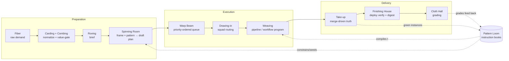

# The Factory Model

**The canonical map of the Mills factory: every machine we have built, the line
they form, and the junctions still missing.** This document consolidates what
was previously scattered across `.loom/brainstorm-mills-steering-preparation-line-2026-07-03.md`
(the framings + textile glossary), `docs/PATTERN_LOOM.md` (the patterns
library), `docs/mills-async-spins.md` (the Spinning Room), the dynamic-workflows
doc set (`.loom/130–135`), and a dozen shipped-MR trails. When a subsystem doc
and this map disagree, fix whichever is stale — this file is the index, not a
fork.

Last full reconciliation: 2026-09-10 (junction statuses in §4 and the
sequence in §5; §2–§3 inventory last swept 2026-08-01).

## 1. The line

A textile mill is one continuous line: raw fiber in, graded cloth out, and
every machine feeds the next. That is the model Mills is converging on — not a
pile of features, but a production line where each stage's output is the next
stage's input and quality signals flow backwards.

Two feedback loops make it a factory rather than a conveyor:

- **The pattern loop** — merged pattern-conformant work increments the
  pattern's green-instance count (taste gate), unlocks engrams, and improves
  the instruction book the next spin starts from.
- **The grading loop** — human + eval judgment on finished cloth routes future
  work (squads, frames, patterns) toward what actually earned a "keep".

## 2. Machinery inventory — as built

Everything below is merged and live unless marked otherwise.

| Machine | Textile role | Implementation | Provenance |
|---|---|---|---|
| **Spinning Room** | fiber → yarn (plan drafting) | `pkg/mills/spin/` — policy-gated frames (mule / ring / open-end / jacquard / flyer), one council `Edit` over a brief → draft plan in the Plan Store; competitive multi-frame spins; async spins with durable `spin_runs` + watchdog | !915, !918, !925/!926, !959/!960 |
| **Warp Beam** | ordered warp threads | `Plan.Priority` (P0–P3) → plan-slice emitter propagates onto backlog items → dispatcher orders `priority ASC, created_at ASC` | !912 |
| **Take-up motion** | auto-wind finished cloth | `pkg/mills/takeup/` — MR merged ⇒ slice phase merged + emitted item closed; MR closed-unmerged ⇒ deduped orphan decision; plan DAG walked to `merged`; bounded ticks + metrics | !913, !916 |
| **Pattern Loom** | instruction books | `pkg/agentcontext` patterns (`agent_patterns_v1`): materials schema, pins, gauge, slice template, deploy contract; `stamp(pattern, materials) → Plan`; 4 approved patterns (go-rest, go-mcp, go-cli, python-fastapi); taste gate (candidate→approved on green instances); HUD Patterns panel + Factory pattern shelf | !831–!841, !911 |
| **Engram tech tree** | proven techniques | Tier-1 engrams seeded from patterns (10), prerequisite DAG, proof contracts; `agent_engram_*` tools | !836, !911 |
| **Weaving (pipeline)** | shuttle + reed | `pkg/mills/pipeline/` — research → plan_slice → implement → gates → mr → ci_watch → merge → cleanup; scope envelopes + amendment, keyed stage spawns, carry-forward diffs, health-gate admission (observe), escalation classification + auto-requeue | continuous |
| **Weaving (workflow programs)** | jacquard loom | `pkg/mills/workflow/` — Starlark imperative runtime, durable memoized-step journal, exactly-once spawn across dual crash (S1c 3/3), `implement-gate@v1` template, `ClaimWorkflowStart` kernel; **lane LIVE 2026-08-01**, first production run succeeded | !645–!663, !1339–!1355 |
| **Overseers** | overlookers walking the alley | `pkg/mills/overseer/` — groomer (dedup/zombie/stale), sentinel (probes + admission suppression), foreman (stuck/throughput/storm/burn rules), shepherd (escalated-shelf drain: bounded relaunch of auto-requeue-unreachable escalations + closed-MR orphan attention); guarded auto-act substrate extracted to `pkg/mills/guard` (harness + audit recorder, default dry-run; council mutator = second consumer, actor `council.mutator`); observability via `mills_overseer_*` metrics (ticks, actions by mode, suppression gauge) | !1170–!1174, soak live 2026-08-01 |
| **Mill-floor views** | windows onto the floor | Factory panel (loom animation, bolt archive, andon, departure board, creel, fuel gauge, shift report, pattern shelf), Warps/Shuttles/Sparks/Bolts views, Operator Deck, iOS companion Mills tab | !1008–!1040, !1210, !1248 |
| **Demand intakes** | bale breaking | plan-slice emitter (`psl-*` items), canary scheduler, GitLab-issue import, REST enqueue (stamp `enqueue:true`), plan→repo bootstrap, roadmap intents | various |
| **Governance** | line shaft + governor | GitOps policy ConfigMap (frames, budgets, gates, overseers; **every edit needs a policy-checksum bump**), budget enforcer with escalation-class discounting, kill-switch | continuous |

## 3. Mill staff — the lanes that decide

The machinery above weaves; the staff decide. Three supervisory lanes sit at
three phases of the line and deliberately stay separate systems — different
cadences, failure domains, and promotion gates. Code names stay
(`council`/`squads`/`overseer`); the themed names below are the docs + HUD
vocabulary. Full charter: `.loom/brainstorm-mill-staff-consolidation-2026-08-01.md`.

| Dept | Code | Phase | Decides | Status |
|---|---|---|---|---|
| **Drawing Office** | `pkg/mills/council` + `pkg/mills/runner` | plan-time | what enters the mill: briefs → proposals → backlog items / plans / workflow selections; dedup at authoring | live (cron 6h + manual + incident); Debate Mode designed but unwired |
| **Drawing-in Room** | `pkg/mills/squads` | dispatch-time | which crew a committed run is bound to; outcome memory feeds routing confidence | live since 2026-05 but **advisory** — the Decision is telemetry-only, and imperative-lane runs are never routed (attribution hole) |
| **The Alley** | `pkg/mills/overseer` | floor-time | guarded interventions on the running floor: dedup-close, zombie-close, demote, suppress admission, file issue, alert, pause | merged 2026-07-19, **never deployed** — no `overseers:` block in the live policy ConfigMap |

Shared substrate (the consolidation direction): one text-similarity leaf
(`textsim` — today the Jaccard/gray-band constants are mirrored in three
files), the overseer harness's guarded-action discipline (dry-run default,
allow flags, durable caps, audit actors) extracted for all lanes, and one
Mill Staff HUD group. Each lane sheds the dead code that reaches into another
lane's territory (squads' Planner → Drawing Office; council's stale-plan/
status evaluators → the Alley).

**Vocabulary collision**: `pkg/weaver` (the daemon-side local-model tool
orchestrator) is *not* mill staff and shares no code with Mills; the HUD
Shuttles panel's "weaver capacity" strip uses the word for a fleet agent in
the loom metaphor only.

## 4. The missing junctions

The pieces above work; what makes the factory feel scattered is that the
**connections between them** were never built. Six junctions, ordered by
leverage:

### J1 — Spinning Room ⊥ Pattern Loom (pattern-first spinning) — **HALF BUILT**

The factory had two demand front-doors that didn't know about each other:
spins author **free-form** plans (the spinner never consults the catalog),
and pattern stamps went through a separate HUD path that skips ideation
entirely. The 2026-07-03 brainstorm named the combination explicitly
("choosing a frame also chooses card constraints").

**Built (front door, 2026-08-01 `5daca548`, consolidated 2026-08-30
`b91513df`)**: the SpinPlanDialog has a `pattern` mode next to the classic
`free` mode — pick an approved card from the shared `patternsStore`
(`PatternCardPicker`), fill its materials (`PatternMaterialsFields`), stamp.
One dialog, both doors.

**Still open (the spinning half)**: `pkg/mills/spin/spin.go` still has zero
pattern references. A patterned *spin* — extract materials from the brief,
run the stamp core for structure (pins, slice template, gauge), use the frame
model only to fill the pattern's open axes — is unbuilt, and per §6 stays
behind catalog coverage: at ~5% coverage of real demand the dialog's pattern
mode is the honest scope.

### J2 — Green merges don't feed the taste gate (auto-harvest) — **SHIPPED 2026-08-01**

`agent_pattern_record_instance` (green count + auto-promote) was called
**manually**; the take-up reconciler already watched every MR reach `merged`.

**Built**: when take-up itself advances a `plan-stamp-<slug>-…` plan to
`merged` (the one-shot observation point — a merged plan leaves the active
scan), it longest-slug-matches the stamp against the approved catalog
(mirroring the Factory shelf's attribution rule) and records a green instance
via `agent_pattern_record_instance` — taste gate incremented, auto-promotion
live, MR refs in provenance. `takeup.Reconciler.Patterns` /
`clients.PatternClient.RecordInstance`; outcomes in
`mills_takeup_pattern_harvests_total{recorded|unmatched|error}`.

**Still open (A2 tail)**: authoritative engram `file_ref` verification —
`repo_root` resolves on the *agent-context pod's* filesystem, which has no
checkout, so composed engrams stay safely `unverified` until that pod gets a
merged-instance tree (or the verify moves operator-side behind a trusted
seam). Also unharvested: a stamped plan advanced to merged by an agent rather
than by take-up.

### J3 — Patterns don't compile to workflow programs (dobby/jacquard cards) — **NOT STARTED**

Patterns produce prose slices executed by the general pipeline; the workflow
engine executes hand-written templates (`implement-gate@v1`). F8's tiering —
**dobby cards** (simple parameterized stamps compiled to a deterministic
program) and **jacquard cards** (multi-slice programs on the durable engine) —
is the proven-lever path to autonomous merge rate. Council-side template
authoring was deliberately deferred "until a proven live run" — satisfied
2026-08-01.

**Build**: a stamp for a dobby-class pattern emits a frozen workflow selection
(template + params) instead of a bare plan-linked item, riding
`ClaimWorkflowStart`. Start with one card (e.g. changelog-fragment/docs-drift
class), measure merge rate vs the pipeline lane.

### J4 — Cloth Hall (grading feeds nothing) — **SHIPPED 2026-08-13 (S1–S4)**

Eval verdicts and KPI snapshots existed, but the operator's judgment never
re-entered the system, and eval grades didn't route future work.

**Built** (taste-gated demand epic, `.loom/195-plan-taste-gated-demand-autonomy-2026-08-12.md`):
one-tap grading (keep / meh / regret + one line) on bolts —
`POST /api/mills/pipeline/runs/{id}/grade`, `pkg/mills/run_grade.go`
(S1 !1582); the one-tap UI on the Factory surfaces (S2 !1585); taste
aggregates with a rolling-14d coverage ratio, a guarded squad-routing blend
and record-only pattern grades (S3 !1594); workspace-signal verification
(S4 !1596). The bolt-card read model (`pkg/mills/boltcard`, 2026-08-22) and
the server shift ledger (`GET /api/mills/shift-report`, `pkg/mills/shiftreport`,
!1780 2026-09-01) put grades in context. Coverage went 0% → 85.6% in the
2026-08-15 catch-up batch; the operator's standing policy is
best-instance-per-theme keep, duplicate re-proposals regret.

**Still open**: S5 ranked-dispatch extension and S6 outcome-grade writeback
hold for the 14-day grade-coverage soak (≥60% gate); grade-in-context web
(S3 web) is queued and retires the triplicated TS shift derivation; grade
calibration (S4 calibration) is escalated; items merged without a pipeline
run have no grade endpoint (item-level grading is a known gap).

### J5 — Finishing House (merged ≠ delivered) — **BUILT**

The line ends at merge + eval. Deploy verification (did Flux actually roll the
image the merge produced?), docs freshness, and a finished-goods digest are
ad-hoc.

**Built**: the deployment-aware dependency gate — the reconciler holds a
queued item whose merged dependency changed operator code until that merge
commit is an ancestor of the running operator build
(`Reconciler.OperatorBuildSHA`, `gitIsAncestor`, hold reason
`dependency_undeployed`). And, since 2026-09-10 (!1894, slice S2), the
docs-freshness departure: the operator compares Git blob IDs of `docs/`
against the flexinfer-site mirror hourly; missing and stale files appear in
the shift ledger and as Prometheus metrics, an unavailable source or API is
reported as `unknown` and never blocks the ledger, and sync remains an
explicit human or agent action in the site repository
(`docs/FLEXINFER_SITE_INTEGRATION.md`).

**Built (S1, 2026-09-11)**: per-bolt deploy confirmation in the shift ledger
— each merged home-project bolt is compared with the running operator build
and reports `live`, `pending`, or `unknown` deployment evidence, reusing the
reconciler's git-ancestry gate; gauges `mills_finishing_bolts_pending` and
`mills_finishing_bolts_unknown`.

**Built (S3, 2026-09-16)**: the daily finished-goods digest.
`pkg/mills/finishing/digest` composes it deterministically from the shared
24-hour shift-report composer; the operator appends it once per UTC day to
the event ledger (`finishing.digest`), delivers it through the reconciler's
digest and mobile push hooks, and serves it — read, and admin rerun of a
completed day — through the operator and HUD proxy APIs
(`docs/MILLS_RUNBOOK.md`, "Finished-goods digest"). No LLM is used.

### J6 — Carding (demand refinement stays manual) — **NOT STARTED, EVIDENCE-GATED**

Intakes exist but nothing continuously turns raw fiber (TODOs, flaky tests,
docs drift, audit findings, renovate leftovers) into combed, value-gated
briefs for the Spinning Room. Prereqs once blocking this (escalation-class
budget discounting, the !899 no-op-DoS lesson) have since shipped. Still
gated on evidence: build carding only if beam occupancy stays low with
operator-driven spinning (the Live Beam memory's 2–3 week watch).

## 5. Build sequence

The junctions are deliberately small — each is a seam between two shipped
systems, not a new system. Sequence reflects the §6 kill-test result
(2026-08-01): the current catalog does not cover observed demand, so pattern
*authoring from demand* comes before wiring the spin path to the catalog.

1. **J2 auto-harvest** (smallest, closes the pattern loop, zero UX) —
   take-up → record_instance + engram verify.
2. **Card authoring from observed demand** (B2 flow) — **CANDIDATES SHIPPED
   2026-08-01**: the four classes are authored as repo-native patterns in
   `pkg/agentcontext/schema_patterns_loomcore.go` (`pattern-loom-runbook`,
   `pattern-mills-metric`, `pattern-operator-read-endpoint`,
   `pattern-hud-panel`), each with recon-extracted pins that also FIX
   observed drift (mandatory runbook dedup+index step; non-optional
   three-table metric tests; the []-never-null and SPA-fallback endpoint
   regressions; the no-initial-tick / untrack() panel gotchas). Six new
   Tier-1 engrams carry in-repo exemplar proofs
   (`schema_engrams_loomcore.go`). Still `candidate`: approval needs a
   follower kill-test per card (the !911 method — manifest dump →
   context-free follower → independent gauge) or a first J2-harvested
   green instance after human force-promote.
3. **J3 dobby cards** — compile the proven cards to frozen workflow
   selections on the imperative lane; measure merge rate vs the pipeline
   lane. **Not started.**
4. **J1 pattern-first spinning** (connects the two front-doors) — **dialog
   picker SHIPPED 2026-08-01**; the stamp-guided *spin* stays behind catalog
   coverage (§6).
5. **J4 cloth-hall grading** — **SHIPPED 2026-08-13 (S1–S4)**; S5/S6 hold
   for the grade-coverage soak.
6. **J5 finishing** — **SHIPPED 2026-09-16 (S1–S3)**: the deploy-verify pain
   bit, and the docs mirror drifted unnoticed. Three deterministic slices,
   each a shift-ledger departure: per-bolt deploy confirmation (S1),
   docs-freshness drift (S2), daily finished-goods digest (S3).
7. **J6 carding** (evidence-gated; only on sustained empty-beam days).

## 6. Riskiest assumption + kill-test

**Load-bearing assumption (for J1 + J3):** the pattern library can cover a
meaningful share of *real* Mills demand. Every pattern proof to date ran on
synthetic materials (widget/gadget/sprocket, `examples/`); zero production
backlog items have flowed through a stamp. If patterns only fit greenfield
scaffolds, pattern-first spinning is steering theater and dobby cards compile
work that never arrives.

**Kill-test (≤1h, before J1 lands):** pull the last ~20 real terminal backlog
items (merged + escalated, excluding canaries). For each, judge: would an
approved pattern or a plausible dobby card have covered it (fully / partially
/ not at all)? Unambiguous outcome: ≥25% full-or-partial coverage justifies
J1+J3 as sequenced; below that, invert — build J4 grading + B2 pattern
*authoring* (grow the library from observed demand classes) before wiring the
spin path.

**Status: RUN 2026-08-01 — the assumption failed for the current catalog and
passed for repo-native cards, so the sequence inverts.** Dataset: the 20 most
recent real terminal backlog items plus the 80-run history window (46 done /
34 escalated — the mill merges steadily; done items rotate out of the backlog
listing, which is why a backlog-only view looks all-escalated).

- **Current 4-pattern catalog coverage: ~1/20 (5%).** The catalog is
  greenfield service scaffolds; observed demand is overwhelmingly brownfield
  loom-core work. Only one item (a "spec out an app to track X" brainstorm)
  is on the catalog's home turf.
- **Repo-native dobby-card coverage: ~7–8/20 (~35–40%).** Four recurring
  demand classes each follow a rigid, already-documented recipe and are
  card-shaped: **operator runbook / docs page** (≥5 of 20), **HUD panel/strip
  scaffold** (panelRegistry + createPoller + helpers + tests), **read-only
  operator REST endpoint** (handler + DAO query + proxy route + test), and
  **metric + alert + dashboard row**.

**Consequence:** do not wire pattern-first spinning to the existing catalog
(steering theater at 5% coverage). Mine the four observed classes into
candidate patterns first (B2 authoring flow), then compile those cards and
wire the spin path. Section 4's sequence reflects this.

## 7. Glossary

The full 27-row machinery → subsystem mapping lives in
`.loom/brainstorm-mills-steering-preparation-line-2026-07-03.md` (Appendix).
Short form of the names this doc relies on:

| Term | Meaning here |
|---|---|
| fiber / sliver / roving | raw demand → normalized item → brief |
| frame (mule/ring/open-end/jacquard/flyer) | model+backend a spin runs on |
| yarn / warp beam | draft plan / the priority-ordered queue |
| shuttle / reed | spawned agent / the gates |
| cloth / bolt / spark | merged work / a finished run / an escalated run |
| card (dobby/jacquard) | executable pattern program (simple / multi-slice) |
| take-up | merge-driven state reconciliation |
| cloth hall | grading of finished work |
| drawing office / drawing-in / the alley | the staff lanes: council (plan-time) / squads (dispatch-time) / overseers (floor-time) — see §3 |
