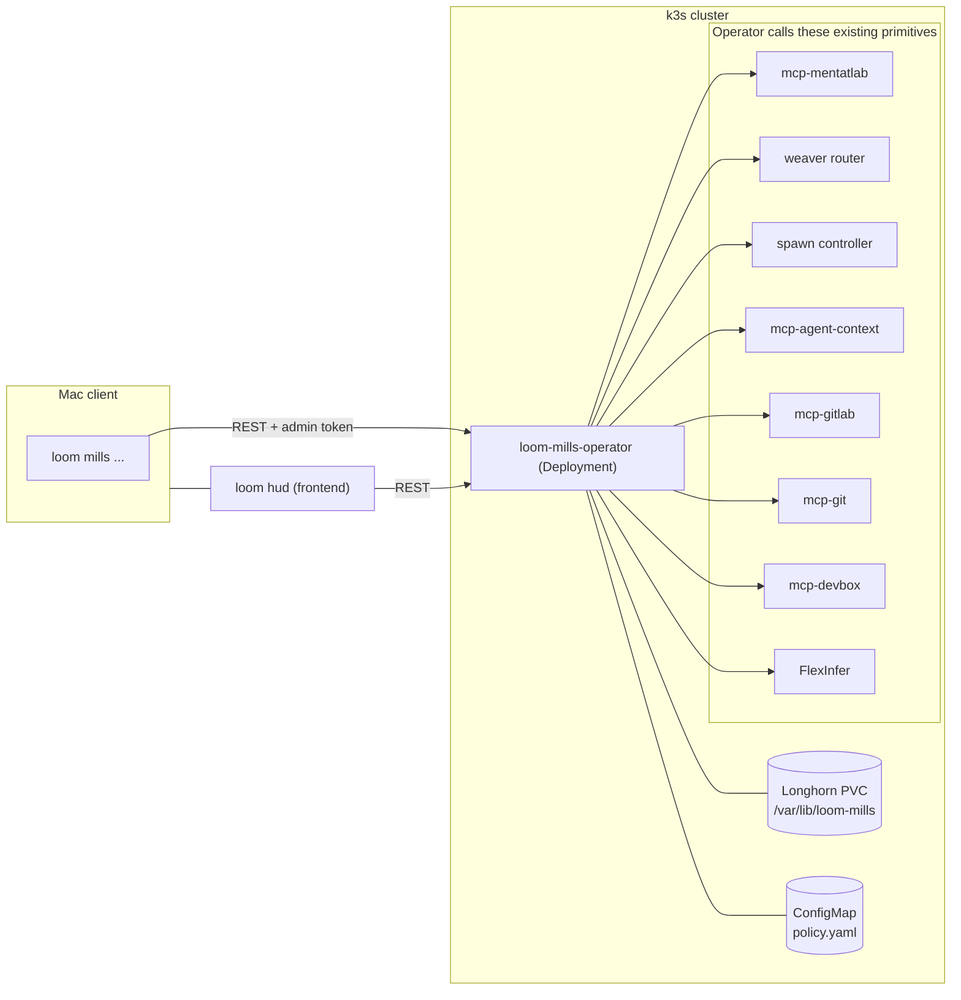

# Loom Mills — Operator Reference

Loom Mills is the cluster-resident meta-orchestration layer above weaver, spawn, and MentatLab. It runs continuous software development with a planning **Council** that emits `.loom/` artifacts + backlog deltas and a deterministic, gated execution **Pipeline** that turns each backlog item into a merged change. "CI above CI for agents."

This document is the architecture and operator reference for Mills v1. For day-2 procedures (pause/resume, recovery, replay, rollout staging), see `docs/MILLS_RUNBOOK.md`. The active forward-looking design is `.loom/92-…mills-v2…md` through `.loom/94-…mills-v2…md`. For the consolidated map of every mill subsystem — the production line they form, the feedback loops, and the junctions still missing — see [docs/FACTORY_MODEL.md](FACTORY_MODEL.md).

## High-Level Architecture



The Mac is read-mostly; the operator pod is the only writer. SQLite + WAL + Longhorn RWO PVC is the canonical store. `.loom/backlog/*.yaml` is a derived export; GitLab issues are a federated mirror.

## Components

| Component | Source | Purpose |
|---|---|---|
| **Operator binary** | `cmd/loom-mills-operator/` | Process lifecycle; REST + MCP on `:8090`; healthz/readyz/metrics on the separate `:9090` listener. |
| **Canonical store** | `pkg/mills/store/` | SQLite + WAL; migrations under `pkg/mills/store/migrations/`. DAOs per surface (`dao_backlog.go`, `dao_council.go`, `dao_pipeline.go`, `dao_eval.go`, …). |
| **Policy + budget** | `pkg/mills/policy.go`, `pkg/mills/policy_manager.go`, `pkg/mills/budget.go` | YAML policy with fsnotify hot-reload; per-tier rolling budgets. |
| **Reconciler + scheduler** | `pkg/mills/reconciler.go`, `pkg/mills/scheduler.go` | 60s tick (idle-throttled to 5min); cron + event triggers. |
| **Council** | `pkg/mills/council/` | `roadmap.go` extractor, `brief.go` assembler, `reviewer.go` dispatcher, `editor.go`, `artifacts.go`, `backlog_mutator.go`. |
| **Pipeline** | `pkg/mills/pipeline/` | `runner.go` per-DAG engine, `dispatcher.go` per-stage workers, `integrator.go` fan-out, `escalate.go` handoff path, `recursion.go` (v2). |
| **Gates** | `pkg/mills/gates/` | Pure-Go gates (`nonempty_diff`, `diff_size`, `scope`, `path_policy`, `secret_scan`, `commit_format`, `docs_guardrail`) and LLM-judged gates (`spec_conformance`, `pr_self_review`, `regression`). |
| **Eval** | `pkg/mills/eval/` | Loop A (artifact judge), Loop B (per-merge attribution + Council ROI), Loop C (cross-run consistency). |
| **Clients** | `pkg/mills/clients/` | Wrappers for FlexInfer, GitLab, Git branch merger, MCP hub (devbox/handoff/worktree), HUD spawn API. |
| **MentatLab template** | `cmd/mcp-mentatlab/templates/mills-default-pipeline.yaml` | Default DAG: `plan_slice → research → implement → tests → pr_self_review → mr → ci_watch → merge → cleanup`. |
| **HUD `Mills` view** | `internal/hud/frontend/src/lib/components/mills/` | Mill-floor spine `WarpsPanel` (queued plans by priority), `ShuttlesPanel` (active runs), `SparksPanel` (escalations), `BoltsPanel` (merged cloth) — these replaced the retired generic `BacklogPanel`/`PipelinesPanel` (legacy `#mills/backlog`→warps, `#mills/pipelines`→shuttles redirects kept). Plus `CouncilPanel`, `EvalPanel`, `FactoryPanel`, `TelemetryPanel`, etc. Shared drawers `BacklogDetail`/`PipelineRunDetail` reused across views. |
| **Mac CLI** | `cmd/loom/cmd_mills*.go` | `loom mills status`, `loom mills council {dryrun,run}`, `loom mills backlog {list,get}`, `loom mills eval list`, `loom mills pipelines {list,get}`. |

## Deployment

The operator runs as a single-replica Deployment in the `loom-mills` namespace on k3s.

| Manifest | Purpose |
|---|---|
| `platform/gitops/k3s/mills/namespace.yaml` | `loom-mills` namespace |
| `platform/gitops/k3s/mills/serviceaccount.yaml` + `role.yaml` + `rolebinding.yaml` | RBAC for cross-namespace secret read (`cluster-agent-auth`, `cluster-agent-api-keys`) and own-namespace ConfigMap patch |
| `platform/gitops/k3s/mills/pvc.yaml` | `mills-state` Longhorn RWO 5Gi |
| `platform/gitops/k3s/mills/deployment.yaml` | Deployment with amd64 `nodeSelector`, liveness/readiness probes, `imagePullSecrets: [harbor-creds]`, and a `/workspace/loom-core` repo-root mount |
| `platform/gitops/k3s/mills/service.yaml` | ClusterIP for in-cluster MCP/REST |
| `platform/gitops/k3s/mills/configmap-policy.yaml` | Mounted at `/etc/loom-mills/policy.yaml` |
| `platform/gitops/k3s/mills/servicemonitor.yaml` | Prometheus scrape |
| `platform/gitops/k3s/mills/cronjob-backup.yaml` | Nightly SQLite dump → MinIO `loom-mills-backups/` |

Bring-up:

```bash
# From the platform/gitops repo:
flux reconcile kustomization apps -n flux-system
kubectl get deploy -n loom-mills loom-mills-operator
kubectl logs -n loom-mills deploy/loom-mills-operator --tail=200
```

Healthz and readyz live on the metrics listener (`:9090` by default). `/healthz` checks SQLite liveness. `/readyz` is service readiness: it flips to 200 after migrations, policy load, and operator wiring complete. It does not mean Mills is safe to run autonomous writes.

Autonomy readiness is reported by `/api/mills/status` and `/api/mills/capabilities`. These responses include `autonomy_ready`, `autonomy_blockers`, and a capability matrix with rows for SQLite, policy, admin auth, repo root, FlexInfer, GitLab, HUD spawn, MCP hub/session, dispatcher write stages, council participants, branch contract, and KPI writer. When `policy.enabled=true`, required red or stubbed rows keep `autonomy_ready=false` while read-only API surfaces can remain available.

## Configuration

Environment variables (canonical prefix `LOOM_MILLS_*`); see `cmd/loom-mills-operator/config.go` for the authoritative list.

| Var | Default | Purpose |
|---|---|---|
| `LOOM_MILLS_DB_PATH` | `/var/lib/loom-mills/state.db` | SQLite path (Longhorn-backed). |
| `LOOM_MILLS_POLICY_PATH` | `/etc/loom-mills/policy.yaml` | YAML policy; fsnotify hot-reloaded. |
| `LOOM_MILLS_HTTP_ADDR` | `:8090` | REST + MCP listener. |
| `LOOM_MILLS_METRICS_ADDR` | `:9090` | `/healthz`, `/readyz`, `/metrics`. |
| `LOOM_MILLS_REPO_ROOT` | `/workspace/loom-core` | Council artifact write root + brief reader root. |
| `LOOM_MILLS_ENABLED` | unset | `true`/`false` overrides the policy's `enabled` bit; unset defers to the YAML. |
| `LOOM_MILLS_DEBUG` | unset | Enables debug-level slog. |
| `FLEXINFER_PROXY_URL` | unset | Required for LLM-judged gates and the research stage. |
| `FLEXINFER_TOKEN` / `FLEXINFER_JUDGE_MODEL` / `FLEXINFER_WEAVER_MODEL` | unset | FlexInfer client tuning. On a `litellm` backend these hold the gateway-routable model id (e.g. `or/kimi-k3`). |
| `LITELLM_PROXY_URL` / `LOOM_MILLS_LITELLM_KEY` | unset | Cluster LiteLLM gateway + bearer key (OpenAI-compatible). Required for `litellm`-backed council lenses, judge, or weaver. |
| `MILLS_JUDGE_BACKEND` | `flexinfer` | `flexinfer` (default) or `litellm`. `litellm` routes the rubric judge **and** the council contradiction judge through the gateway on `FLEXINFER_JUDGE_MODEL`; judge hardening (truncation recovery, echo-stripping, `FLEXINFER_JUDGE_MAX_TOKENS`, length-retry) and provider `usage.cost` accounting ride through unchanged. Missing `LITELLM_PROXY_URL`/`FLEXINFER_JUDGE_MODEL` fails loud at startup and degrades to FlexInfer. |
| `MILLS_WEAVER_BACKEND` | `flexinfer` | As above for the research/weaver stage, on `FLEXINFER_WEAVER_MODEL`. Independent of `MILLS_JUDGE_BACKEND`. |
| `FLEXINFER_JUDGE_MAX_TOKENS` / `FLEXINFER_WEAVER_MAX_TOKENS` | `1024` | Completion budget for the rubric judge / research (weaver) stages. Default `1024` fits the local qwen models. **Set `>= 4096` for a reasoning model** (e.g. `or/kimi-k3`): a thinking model returns its chain-of-thought in a separate `message.reasoning_content` field whose tokens count against `max_tokens`, so at `1024` the reasoning consumes the whole completion and the judge envelope / research notes come back empty. Both paths also make one reasoning-aware boosted retry (floored to 4096 when the squeezed response showed reasoning activity) so a squeeze never surfaces empty without a retry, but the env budget is the durable fix. Non-positive/blank ⇒ default. |
| `MILLS_TELEMETRY_CACHE_TTL_SECONDS` | `8` | Stage telemetry roll-up cache TTL in seconds. Valid integer values are clamped to `1`-`60`; unset, blank, or non-integer values use the default. |
| `FLEXINFER_JUDGE_MODEL_FALLBACKS` / `FLEXINFER_WEAVER_MODEL_FALLBACKS` | unset | Comma-separated degrade chain. On a `litellm` backend these are interpreted as **gateway-routable** ids (backend-local: the aimodels-registry FlexInfer chain is suppressed so a frontier outage never walks to a proxy model the gateway can't route). Empty ⇒ no fallback; the gate soft-fails/escalates like any FlexInfer outage rather than wedging. |
| `GITLAB_API_URL` / `GITLAB_TOKEN` / `GITLAB_PROJECT` | unset | Required for `mr/ci_watch/merge/cleanup` stages and escalation issues. |
| `LOOM_MILLS_REGRESSION_SWEEP_INTERVAL` | `1h` | Cadence of the post-merge regression attribution sweep (Go duration). Each pass is two read-only GitLab list calls; the sweep is disabled entirely without a GitLab client. Non-positive values are ignored. |
| `LOOM_MILLS_SIGNATURE_MINING_INTERVAL` | `6h` | Cadence of the signature-candidate mining sweep (Go duration). Each pass is one store read plus in-process clustering over the last `336h` of escalations; no external dependency, so it arms whenever the store is present. Non-positive values are ignored. |
| `LOOM_MILLS_LEARNING_SIGNAL_INTERVAL` | `30m` | Cadence of the learning-signal export sweep (Go duration). Each pass rebuilds the judge-calibration, promotion-evidence and config-outcome reports and republishes them as gauges. Non-positive values are ignored. |
| `LOOM_MILLS_LEARNING_SIGNAL_WINDOW` | `336h` | Window those gauges describe (Go duration), matching the report endpoints' default. Narrow it when the window grows past the builders' 10000-row scan limits and every export fails. Non-positive values are ignored. |
| `LOOM_MILLS_LEARNING_SIGNAL_EXPORT` | on | `0/false/no/off` disables the export sweep. The JSON report endpoints are unaffected — the same builders serve both. |
| `LOOM_HUD_URL` / `LOOM_HUD_TOKEN` | unset | Required for `plan_slice/implement/pr_self_review` spawn-driven stages. |
| `LOOM_MCP_HUB_URL` / `LOOM_MCP_PROFILE` | unset | Required for devbox/handoff/worktree clients. |
| Admin token | env (operator-side) | Required for mutating endpoints; check `cmd/loom-mills-operator/auth.go`. |

At startup, the operator attempts to bootstrap `LOOM_MILLS_REPO_ROOT` as a shallow `services/loom-core` checkout when GitLab URL/project/token configuration and the `git` binary are available. In k3s this path is mounted from the singleton Longhorn PVC at `/workspace/loom-core`, sharing the same single-writer ownership model as SQLite. If the clone, fetch, git metadata, `.loom` existence, or writability check fails, the pod still serves read-only APIs but the `repo_root` capability stays red and unattended backlog execution remains blocked.

When a backing service env is missing, the operator boots in a degraded mode: affected stages fall back to a NoOp dispatcher and the gap is logged and exposed in the capability matrix. The scheduler and read-only APIs may still run, but the reconciler skips queued work while `autonomy_ready=false`; no unattended pipeline starts are allowed until the required capability rows are green.

### GitLab-unreachable gate evaluations

Gate evaluation fails closed when a GitLab read cannot produce a verdict. A
GitLab-attributed DNS failure, connection failure, transport timeout, or edge
502/503/504 is classified as `external_dependency`; it never becomes a passing
gate or a repository failure. The run is parked with the retry disposition
`wait_for_dependency_recovery`, preserving its paid retry budget until GitLab
recovers. Authentication failures, caller cancellation, malformed responses,
and generic non-GitLab infrastructure errors are not included in this class.

Alert on sustained increases in
`loom_mills_gate_gitlab_unreachable_evaluations_total`. During an incident,
confirm GitLab API and edge-proxy health, leave affected runs parked, and avoid
manually overriding their gate outcomes. After GitLab is healthy, requeue the
parked runs; normal gate evaluation reruns against the unchanged branch and can
then pass or report a real gate failure.

## Policy reference

`pkg/mills/policy.go` defines the schema. The on-disk YAML maps 1:1.

```yaml
version: 1
enabled: true                            # kill switch (defaults to enabled when omitted)
budgets:
  council:
    max_usd_per_run:  15.00
    max_usd_per_day:  50.00
  pipeline:
    max_usd_per_run:   5.00
    max_usd_per_day:  75.00
    max_concurrent_runs: 4
    max_runs_per_day:   20
council:
  schedule_cron: "0 5 * * *"
  triggers:
    on_roadmap_change:  true
    on_incident:        true
    on_merge_drift_hours: 48
  ensemble:
    editor:    { name: editor,   model: claude-opus,           backend: spawn }
    reviewers:
      - { name: architect, model: claude-opus,         backend: spawn,     lens: architecture }
      - { name: security,  model: codex-gpt5,          backend: spawn,     lens: security }
      - { name: tech_debt, model: llama-4-70b-instruct, backend: flexinfer, lens: tech_debt }
    judge:     { name: judge,    model: llama-4-70b-instruct,  backend: flexinfer }
  artifacts_branch:           "council/{date}"
  artifacts_merge_strategy:   "fast-merge-loom-only"   # or "always-mr"
  # Fail-closed intent guardrail (default ON when omitted). A council run whose
  # brief was marked intents_missing — the canonical `roadmap_intents` store came
  # back empty — aborts before reviewers or the editor spend anything. Set to
  # `false` as break-glass to let planning proceed against an empty store.
  require_roadmap_intents:    true
  # Merged-work grounding (default ON when omitted). Suppresses proposals that
  # restate a merge request main already took. See "Merged-work grounding".
  dedup:
    merged_work:
      enabled:        true
      lookback_hours: 336   # 14d; 0 = default
  # Factory-exhaust demand (default ON when omitted). Surfaces the mill's own
  # open flaky-test / audit-digest issues into the brief. See "Factory exhaust
  # as demand".
  sources:
    factory_exhaust:
      enabled:        true
      lookback_hours: 336   # 14d; 0 = default
      max_items:      10    # 0 = default
pipeline:
  default_template: mills-default-pipeline
  # A terminal script_failure is retried once only when every failed job is
  # listed here. The retry and follow-up poll share the original poll deadline.
  ci_watch:
    flaky_jobs: ["test:reliability", "test:unit"]
  protected_paths:
    - "platform/gitops/**"
    - "cmd/loomd/**"
    - "**/*auth*.go"
    - "**/secret*.yaml"
  per_label_overrides:
    - { label: "auto",         auto_merge: true,  human_review: false }
    - { label: "human_review", auto_merge: false, human_review: true }
  retry:
    max_attempts:     3
    cooldown_seconds: 300
  auto_revert_on_regression: false
  # Bounded auto-requeue (default ON): the reconciler requeues retryable
  # escalations itself instead of parking them for a human. See the subsection
  # below for eligibility + caps. Opt out with: auto_requeue: { enabled: false }
  auto_requeue:
    enabled:          true
    cooldown_minutes: 10   # infra/transient wait this long before an unattended retry
    per_item_max:     2    # lifetime unattended retries per backlog item
    per_day_max:      6    # fleet-wide unattended retries per rolling 24h
  # Spawn-transport breaker (default ON): hold new dispatch while the last few
  # runs all died at the spawn layer for the SAME reason (a vendor outage). See
  # the subsection below. Opt out with: spawn_breaker: { enabled: false }
  spawn_breaker:
    enabled:          true
    threshold:        3    # distinct runs with the same spawn reason token
    window_minutes:   30   # rolling observation window
    cooldown_minutes: 15   # hold after the last matching failure
  # Scope-overlap serialization (default ON): a queued item defers while a
  # RUNNING same-repo item's slice envelope intersects its own, so sibling
  # items pinning the same package land sequentially instead of producing
  # mutually-conflicting MRs (escalations #290–#305). Opt out with:
  # serialize_overlapping_scopes: false
human_handoff:
  on_escalation_create_handoff: true
  on_escalation_create_issue:   true
  notify_agent_id: ""
```

Edits to the mounted ConfigMap are picked up via fsnotify within seconds; the operator logs `policy reloaded` on success and continues on the prior version on parse error. In-flight runs continue under the policy they captured at start; new runs use the latest.

### Per-stage spawn selectors (`stage_substrate` / `stage_agents` / `stage_models`)

The three SpawnWorker-driven stages — `plan_slice`, `implement`, `pr_self_review` — accept three orthogonal per-stage overrides under `pipeline`. Each is nil-safe (an unset stage keeps the default) and hot-reloads with the ConfigMap:

```yaml
pipeline:
  # Devbox backend per stage (default k8s). Keys also allow research + tests.
  stage_substrate:
    implement: harvester-vm
  # Spawn VENDOR/harness per stage — closed vocabulary claude-code|codex|gemini.
  stage_agents:
    plan_slice: codex
    implement:  codex
  # Vendor-native LLM MODEL per stage — free-form model id (the agent CLI is the
  # authority; policy only checks a sane token shape). Orthogonal to stage_agents.
  stage_models:
    implement:  gpt-5.6-terra   # codex implementer
    plan_slice: gpt-5.6-sol     # codex planner/coordinator
```

- **`stage_agents`** picks *which* CLI runs the stage. Precedence: `LOOM_MILLS_SPAWN_AGENT` env break-glass (wins for every stage) > policy entry > `claude-code` default. Accessor: `Policy.AgentForStage`.
- **`stage_models`** picks *which model* that CLI runs. Precedence: `LOOM_MILLS_SPAWN_MODEL` env break-glass (wins for every stage) > policy entry > empty (the HUD spawn server's vendor default — `SPAWN_CODEX_MODEL` env / `resolveCodexModel`'s compiled default for codex). Accessor: `Policy.ModelForStage`. The resolved model flows `SpawnRequest.AgentModel` → HUD spawn API `model` → `spawn.Request.Model` → `codex exec --model`. **Only the codex path consumes it today**; `claude-code`/`gemini` have no headless model flag, so a set model is ignored with a wiring log (`spawn model override ignored: agent has no headless model knob`), never an error.

Both are the *mechanism*: flipping production policy is a gitops ConfigMap edit (`platform/gitops/k3s/mills/configmap-policy.yaml`) that also requires a policy-checksum bump so the deployment's fsnotify picks up the swap. The startup log line `plan_slice/implement/pr_self_review stages wired to HUD spawn API` surfaces the effective `agent_*` and `model_*` values — the **item-less baseline**; per-item routing (below) can move an individual dispatch off them.

Dispatch resolves both selectors through `cmd/loom-mills-operator.spawnRouteFor`, which owns the whole precedence chain including the per-item layer below. `agentForStage` / `modelForStage` compute the same rungs *without* an item and feed the `/wiring` snapshot only; `GET /api/mills/wiring` therefore reports the baseline, not necessarily what a given item ran on.

### Per-item agent routing (`agent_routing`)

`stage_agents` answers "which harness runs `pr_self_review`" — a question about the *stage*, and global across the queue. `agent_routing` answers "which harness runs *this item*", so the fleet can run **claude-code and codex implementers simultaneously** on the same k3s substrate: plans are authored by a frontier model, then each implementation item queues to the harness that suits the work. UI/design/frontend work goes to claude-code; backend/systems/infra work goes to codex.

```yaml
pipeline:
  stage_agents:
    implement: codex          # fall-through for items no rule claims
  agent_routing:
    enabled: true             # omit to default ON when rules are present
    rules:                    # ordered; FIRST match wins
      - match:
          path_globs:
            - "internal/hud/frontend/**"
            - "**/*.svelte"
            - "**/*.css"
        route: {agent: claude-code, model: claude-opus-5}
      - match:
          labels: ["design", "ux"]
        route: {agent: claude-code, model: claude-opus-5}
      - match:
          path_globs: ["pkg/**", "cmd/**", "internal/**"]
        route: {agent: codex, model: gpt-5.6-sol}
```

**Match semantics.** A rule's `match` accepts any of `labels`, `priority` (P0..P3), and `path_globs`. Every *populated* criterion must hold (AND across criteria); each is satisfied by any one of its entries (OR within a criterion). `path_globs` match against the union of the item's slice file paths (`BacklogItem.Slices[].Files`) using doublestar — the same dialect as `pipeline.protected_paths` and squad path classes, so `**` crosses directory separators. An empty `match` is rejected at policy load rather than treated as match-everything. Slice paths are normalized before matching (`./pkg/x.go` and `/pkg/x.go` both match `pkg/**`), because slice file lists are LLM-authored and a silent non-match is indistinguishable from "no rule applied". A **sliceless** item has no paths, so path rules simply never match and it falls through to `stage_agents`.

**Per-item override.** A label of the form `agent/claude-code` or `agent/codex` on the backlog item wins over every rule — the escape hatch for the item the heuristics get wrong. The suffix must be in the closed vocabulary (`claude-code|codex|gemini`); an unknown suffix such as `agent/gpt-9` is **ignored with a warn log**, never fatal, because labels are authored by humans and issue importers and must not be able to wedge dispatch. Two labels naming *different* harnesses are ambiguous — GitLab returns labels in its own order, so honouring the first would make the harness depend on ordering nobody chose — and both are ignored, dropping the item through to the rules.

**Precedence** (highest first), implemented in `cmd/loom-mills-operator.spawnRouteFor`:

1. `LOOM_MILLS_SPAWN_AGENT` / `LOOM_MILLS_SPAWN_MODEL` env — the global break-glass, read once at startup. Routing can never route around it.
2. the item's `agent/<id>` label.
3. the first matching `agent_routing` rule.
4. `pipeline.stage_agents[stage]` (model: `stage_models[stage]`).
5. `claude-code` (`mills.AgentDefault`).

Steps 2–5 are `Policy.ResolveAgentRoute` (`pkg/mills/agent_routing.go`); the operator closure adds only the env layer, the dispatch event, and the ignored-label warning.

**Model follows agent.** A `stage_models` pin names a vendor-native id that is meaningless to a different vendor, so: a route's own `model` always wins; a route that keeps the baseline agent inherits `stage_models[stage]`; a route that **re-targets the vendor** drops `stage_models` and returns empty, letting the new vendor's CLI apply its own default rather than handing codex a `claude-*` id. The resolved model threads the same path as `stage_models` — `SpawnRequest.AgentModel` → HUD spawn API `model` → `codex exec --model` — with the same caveat that only the codex path consumes it today.

The `LOOM_MILLS_SPAWN_AGENT` break-glass carries the same rule: failing over to a different vendor drops the resolved model so the substituted CLI never receives another vendor's id (`codex exec --model claude-opus-5` would fail every `implement` stage, during an outage). A break-glass naming the harness the models were authored for leaves the pin untouched. Set `LOOM_MILLS_SPAWN_MODEL` alongside it to pin a model explicitly across a vendor switch.

> **`model:` is codex-only today.** Per the `stage_models` notes above, only the codex spawn path consumes `AgentModel`; `claude-code` and `gemini` have no headless model flag, so `model: claude-opus-5` on a `claude-code` route is recorded and logged but does not change what runs. It is written in the examples so the intent survives into the day claude-code gains the knob.

**Scope.** Routing applies only to the SpawnWorker-driven stages `plan_slice` / `implement` / `pr_self_review` (the same set `stage_agents` configures). `research` (WeaverWorker) and `tests` (DevboxWorker) consume no harness selection, and gate/judge model selection is a separate system routing does not reach into.

**Observability.** A dispatch that routing actually *claimed* appends a `pipeline.stage.agent_routed` event keyed on the backlog item, payload `{item, stage, agent, model, decided_by, outcome}` — so "why did this item go to codex?" is answerable straight off the event stream, with `rule:<idx>` naming the exact policy line. The same triple is stamped into the stage's `stage_results` artifacts under `agent_routing`.

`decided_by` spans `env`, `label`, `rule:<idx>`, `stage_agents`, and `default`, but **only `label` and `rule:<idx>` are recorded** (`mills.AgentRouted`). The `stage_agents` / `default` / `env` rungs are the pre-routing behavior, and writing a row for them would add a per-dispatch event to the (unpruned) events table of every deployment that never opted in. Read the startup wiring log or `/api/mills/wiring` for those.

**Inert when absent.** With no `agent_routing` block the whole feature is off — including the `agent/*` label, which is part of the routing feature and switches off with it. No routing event, no routing artifact, and identical agent/model resolution: behavior is byte-identical to `stage_agents` alone. Rules are validated (closed agent vocabulary, non-empty match, P0..P3 bands, compilable globs, sane model tokens) at policy **load**, even behind `enabled: false`, so flipping the flag can never be the moment an invalid glob first surfaces. `enabled: true` with zero rules is legal and gives you label-only routing.

### Green-MR adoption (ghost-spark sweep, third outcome)

The ghost-spark sweep's first two passes are archaeology: they close escalated items whose work **already** landed (the run's MR merged out-of-band, or its deterministic branch was merged by hand). Green-MR adoption finishes work that **never** landed.

The shape it exists for is CI infrastructure, not code. On 2026-08-02 a LAN storm made GitLab kill jobs with `runner_system_failure`; ci_watch escalated those runs as if the code were at fault, a human retried the pipelines and they went green on unchanged code — and the MRs then sat **open and mergeable with nobody to merge them**, because the run is terminal and no stage owns it any more. `services/loom-core!1390` and `!1391` waited about seven hours for a human to press a button.

When the IID pass finds an escalated run whose MR is still open, `Reconciler.GhostSparkGreenMRAdopter` (production: `clients.GitLabClient.AdoptGreenMR`) decides. It merges only when **all** of these hold, and refuses on anything ambiguous:

| Check | Requirement | Why |
|---|---|---|
| `state` | exactly `opened` | merged is already someone's success; closed is abandoned |
| `has_conflicts` | `false` | never merge a conflicted diff |
| `detailed_merge_status` | `mergeable` | `ci_still_running`, `discussions_not_resolved`, `draft_status`, `blocked_status` all refuse — a reviewer's open thread can never be merged out from under them |
| `head_pipeline.status` | exists **and** `success` | a *missing* head pipeline is the husk shape (MR/branch split), never green |

A refusal is normal, not an error: it cools the item down (so a permanently-red MR cannot burn a lookup plus a merge probe every tick) and leaves it escalated for a human. An adoption appends `reconciler.ghost_spark_green_adopted`, closes the item through the same claim-version-guarded transition as the other passes with outcome `adopted_green_mr` (so `mills_ghost_sparks_closed_total{outcome="adopted_green_mr"}` separates it from archaeology), and auto-closes the escalation issue. An MR that merges concurrently between the check and the merge counts as success.

**Inert when unwired.** A nil `GhostSparkGreenMRAdopter` restores the previous behavior exactly: every open MR is left for a human.

### Bounded auto-requeue (`auto_requeue`)

Runs escalate for many reasons; a large share are *retryable* — flaky infra, a transient upstream, an external-dependency incident that later clears. Historically each of those parked as `escalated` until a human hit `POST /api/mills/pipeline/runs/{id}/start?requeue=1`, and the escalation issues piled up. `pkg/mills.Reconciler.SweepAutoRequeue` closes that loop: each tick — **after** the ghost-spark sweep, so an item whose MR merged out-of-band is reaped as merged rather than re-implemented — it flips a small, capped number of eligible escalated items back to `queued` through the same claim-version-guarded transition the manual endpoint uses. Requeued items re-enter the normal queue and are admitted, scope-serialized, and budget-checked by `tryStart` on a later tick.

| Policy key (`pipeline.auto_requeue`) | Default | Meaning |
|---|---|---|
| `enabled` | `true` | Kill switch for the sweep (nil ⇒ ON). Set `false` to fall back to human-only requeue. |
| `cooldown_minutes` | `10` | How long after a run escalates before its item is eligible for an unattended retry. |
| `per_item_max` | `2` | Lifetime unattended retries for one backlog item, counted from durable events (survives an operator restart). Once hit, the item parks for a human. |
| `per_day_max` | `6` | Fleet-wide unattended retries over the rolling 24h window — the blast-radius limit. |

**Eligibility** (in order): an item whose latest run opened an MR is skipped (a merged MR is the ghost-spark sweep's; an open/closed MR needs a human branch-fix — requeuing would re-implement). An external-dependency escalation is eligible only once the matching incident is no longer active (below the degraded-mode threshold in the rolling window). Otherwise the run's `escalation_class` decides: `infra` / `transient` / `transient_quota` are eligible after the cooldown; `code` / `config` / unclassified are **never** auto-requeued (a human signal). The sweep also never requeues into an exhausted `budgets.pipeline.max_runs_per_day` (via `CountBudgetedSince`).

Every requeue appends a first-writer-wins audit event (`reconciler.auto_requeued`, keyed on the backlog item), increments `mills_auto_requeues_total{class}`, logs `class`/attempt/cap state, and shows up in the KPI snapshot as `auto_requeues`. Escalation-issue commenting (`auto-requeued (n/cap)`) is an optional injected hook (`Reconciler.AutoRequeueIssueCommenter`); until the Escalator's GitLab issue client is exposed to the reconciler it is **log-only** (a follow-up). Like the spawn selectors, production is a gitops ConfigMap edit plus a policy-checksum bump.

### Spawn-transport breaker (`spawn_breaker`)

Per-run spawn classification already marks each spawn-layer defect retryable — budgeted `infra` for defects that need the spawn/cluster layer repaired, free `transient` for self-clearing rollout collisions (`spawn-pod-lifecycle`, `spawn-runtime-identity-conflict`; see `spawnReasonErrorClass` in `pkg/mills/pipeline/spawn_class.go`) — but nothing aggregated those failures: during a vendor outage (the 2026-07-25 ChatGPT Codex websocket 503s, issue #382) the reconciler dispatched every queued item into the dead vendor in turn, each burning its three spawn attempts before escalating. `pkg/mills.Reconciler.evaluateSpawnBreaker` closes that hole: each tick it reads the durable escalation trail (`pipeline.run.escalated` events, actor `pipeline`) and, when the same `[reason=spawn-*]` token appears on enough **distinct** runs inside the window, **holds new dispatch**.

| Policy key (`pipeline.spawn_breaker`) | Default | Meaning |
|---|---|---|
| `enabled` | `true` | Kill switch (nil ⇒ ON). `false` restores per-run-only handling. |
| `threshold` | `3` | Distinct runs that must escalate with the *same* spawn reason token before dispatch is held. |
| `window_minutes` | `30` | Rolling observation window. It also bounds the maximum hold — failures that age out stop counting. |
| `cooldown_minutes` | `15` | Hold measured from the **last** matching failure. |

**Trip / half-open semantics.** The verdict is derived, not stored: the breaker is open ⇔ some spawn reason token has ≥ `threshold` distinct escalated runs inside `window_minutes` **and** `now < lastFailure + cooldown_minutes`. When the cooldown elapses the breaker half-opens and dispatch resumes; a single fresh same-reason failure re-opens it immediately, because the earlier failures are still inside the (longer) window. Nothing is cached in memory, so an operator restart neither forgets an open breaker nor invents one.

**Fail-safe bias.** The breaker only ever *holds new dispatch*. In-flight runs, dispatch-outbox recovery, terminal backlog sync, the ghost-spark sweep, and auto-requeue are all upstream or downstream of it; no run is killed and no backlog item is mutated. If the escalation read fails, the breaker stays **CLOSED** (logged, dispatch continues) — a broken query must never stop the fleet. The manual `POST /api/mills/pipeline/runs/{id}/start` path is deliberately *not* gated: a human asking for one specific run is an intentional override.

**Observability.** A held tick takes the existing autonomy-blocked path: the durable `reconciler.tick` / `skipped` event with `reason=autonomy blocked` and the breaker line in `blockers[]`, e.g.

```
spawn transport breaker open: 3x spawn-stdin-misconfig in 26m — holding dispatch until 2026-07-25T12:13:00Z
```

plus a `spawn transport breaker open; holding dispatch` warn log. `Reconciler.SpawnTransportBreakerStatus` exposes the same verdict for status surfaces; folding it into the operator's capability report so it also appears in the `/api/mills/status` `autonomy_blockers` array is operator wiring left as a follow-up (the reconciler side is complete). Reads ride the existing `idx_events_occurred` window scan — no new index on the hot `events` append path.

### Signature-candidate mining (learning loop)

The failure classifier only knows the shapes someone already wrote down. Historically each new shape was added after an incident: a recurring external failure burned retries as unclassified `code` for weeks before a human noticed the pattern and hand-mined a signature (the three in `classifyObservedExternalIncident` all arrived that way). `pkg/mills.Reconciler.SweepSignatureMining` inverts that order — it observes the factory's own unexplained failures and proposes signatures as **data**, so growing the taxonomy is a data-driven code change instead of an incident-driven one.

Each pass (default every `6h`, `LOOM_MILLS_SIGNATURE_MINING_INTERVAL`) reads the escalations of the last `336h` (`PipelineDAO.ListEscalationEvidence` — the run's last non-empty stage `log_tail`), drops every run the live classifiers already explain, normalizes the rest, and groups what is left by the longest token phrase at least three of them share.

- **Exclusion is doubly grounded.** A run is explained if any of its four `escalation_*` markers is set (the durable half, mirroring `ListRecentClassifiedCIFailures` inverted) *or* if `pipeline.KnownFailureSignature` matches its text — the real corpus (`ClassifyCIFailureSignature`, `classifyObservedExternalIncident`, `pkg/mills/guard`, the `pkg/mcperror` incident-code table), injected as a func because `pkg/mills` cannot import `pkg/mills/pipeline`. With no predicate wired the sweep is **off**: a miner that cannot tell an explained failure from an unexplained one only proposes signatures the factory already has.
- **Clustering is deterministic — no LLM, no embeddings.** Normalization lowercases and collapses UUIDs, paths, durations, hex/SHAs, and numbers to placeholder tokens (`<uuid>`, `<path>`, `<dur>`, `<hex>`, `<num>`), in that order; clustering indexes every 3–8-token n-gram and takes them longest-first, each claiming the escalations no longer phrase has claimed. Minimum cluster size is 3 and a phrase must carry at least 2 real words, so `"<num> <path> <num>"` is never proposed. The output has to survive being argued with by whoever reviews the promotion, and "these N escalations all contain exactly this phrase" is the only evidence that does.
- **Shadow evaluation, not enforcement.** Each candidate carries `window_match_count`: how many escalations across the **whole** window — including the already-classified ones — the phrase would match if promoted. A phrase that also fires on explained failures is one that would misclassify, and the reviewer sees that before writing the rule. Nothing in the sweep reclassifies a run or changes a retry decision.

Every cluster appends a first-writer-wins event (`signature.candidate`, actor `reconciler.signature_miner`, keyed on the normalized-phrase fingerprint) carrying `phrase`, `member_count`, up to 3 raw `sample_evidence` snippets (≤300 chars each), `first_seen`, `last_seen`, and `window_match_count`, so repeated sweeps over an overlapping window converge instead of accumulating duplicates. `GET /api/mills/signature-candidates?window=336h` lists them newest first. Like the sweeps above it is rate-limited, bounded by its own timeout, and kept out of `TickResult` — a mining failure logs a `reconciler.signature_mining_sweep_failed` event and never wedges the tick.

**Promotion stays a reviewed code change.** A candidate is a proposal; turning one into a live signature means editing the classifier corpus in `pkg/mills/pipeline` (or `pkg/mills/guard`) with a test, at which point the miner stops proposing it automatically.

### Learning-signal export (alertable gauges)

Judge calibration, promotion evidence, configuration outcomes and post-merge regressions are otherwise readable only as request-time JSON from the operator's report endpoints, which the alert pipeline cannot see: a judge could drift for a fortnight and nothing would page. `pkg/mills.Reconciler.SweepLearningSignals` republishes those same reports as Prometheus gauges every `30m` (`LOOM_MILLS_LEARNING_SIGNAL_INTERVAL`) over the last `336h` (`LOOM_MILLS_LEARNING_SIGNAL_WINDOW`).

The sweep is a projection, not a second aggregation: `guard.LearningSignalExporter` (`pkg/mills/guard/learning_signals.go`) calls `BuildJudgeCalibrationReport`, `BuildPromotionReport` and `BuildConfigOutcomeReport` — the same builders the endpoints serve. It is wired from `cmd/loom-mills-operator` as a `mills.LearningSignalPublisher` because `pkg/mills/guard` imports `pkg/mills`, so the reconciler cannot call the builders directly.

| Metric | Labels | Meaning |
|---|---|---|
| `mills_judge_calibration_mean_score` | `gate`, `outcome` (`merged`/`escalated`) | Mean judge score for a gate, split by what the graded run finally did. |
| `mills_judge_calibration_discrimination` | `gate` | Merged mean minus escalated mean — the headline drift signal. |
| `mills_judge_calibration_graded_runs` | `gate` | Verdicts whose run reached a terminal outcome; the sample-size guard for an alert. |
| `mills_promotion_evidence_actions` | `actor` | Audited actions (dry-run plus executed) one guarded actor recorded — the `ZeroEvidence` trend. |
| `mills_config_outcome_merge_rate` | — | Window merge rate across all configurations. |
| `mills_config_outcome_runs` | — | Provenance-stamped runs; the denominator above. |
| `mills_regressions_window_total` | — | Window count of attributed post-merge regressions (a gauge, not a counter). |
| `mills_learning_signal_export_errors_total` | `report` | Failed export passes, by which report could not be built. |

- **Window gauges, not counters.** Each sweep overwrites the previous values, so `rate()`/`increase()` are meaningless on them. `mills_regression_attributions_total` remains the cumulative counter over the same regression events.
- **Bounded cardinality.** Gate names and guarded actors are small fixed rosters. `policy_checksum` (one series per policy revision) and judge model (drifts with every stage pin) are deliberately **not** exported; both stay per-row in the JSON reports.
- **Empty means NaN, not zero.** `MeanScoreMerged`/`MeanScoreEscalated` are `0` in the report when their count is `0`, which on a gauge is indistinguishable from a real zero. The exporter publishes `NaN` instead, and NaN propagates through the discrimination subtraction — Prometheus comparisons against NaN are false, so a threshold alert stays quiet on an empty window rather than firing on a fabricated zero. Read `mills_judge_calibration_graded_runs` first.
- **All-or-nothing.** A pass that cannot build all three reports publishes **nothing**: the gauges hold their last good values and `mills_learning_signal_export_errors_total` says they are stale. Half a window — this pass's means beside the last pass's sample sizes — is a worse alert input than a frozen one. Within a successful pass every Vec family is reset before it is re-set, so a window that lost a gate drops its series instead of freezing the last value it held.
- Like the sweeps above it is rate-limited, bounded by its own timeout, and kept out of `TickResult`; a failure appends a `reconciler.learning_signal_sweep_failed` event and never wedges the tick.

The consumer this exists for is a judge-drift alert: `mills_judge_calibration_discrimination` decaying toward `0` while `mills_judge_calibration_graded_runs` stays healthy means the gate's judge has stopped separating shipped work from escalated work, whatever its pass rate says.

## Persistence schema

`pkg/mills/store/migrations/001_initial.sql` is the v1 foundation; later
migrations extend it in place. Key tables:

| Table | Purpose |
|---|---|
| `roadmap_intents` | Themes/priorities/constraints extracted from `ROADMAP.md`; idempotent by content hash. |
| `backlog_items` | Canonical backlog with id `MILLS-YYYY-MM-DD-NNN`, state machine `queued|running|merged|escalated|paused`, label set, priority, spec doc/anchor, success criteria, an admission `claim_version`, and a compare-and-swap `row_version` exposed as `Revision` in the current Go JSON shape. |
| `council_runs` | Per-run rows: trigger, ensemble snapshot, sidecar JSON, eval verdict, cost. |
| `pipeline_runs` | Per-DAG rows: backlog item, current stage, retry count, integrator parent (when fan-out), MR iid, total cost. |
| `pipeline_budget_reservations` | One estimated-spend/worker-slot reservation per admitted run; released idempotently when the aggregate becomes terminal. |
| `pipeline_transitions` | Immutable queued-to-running admission ledger, unique by backlog item and aggregate version. |
| `pending_dispatches` | Durable start outbox with leased delivery, bounded backoff, and terminal dead-letter state. |
| `stage_results` | Per-stage row attached to a run: stage id, output JSON, started/ended/cost. |
| `gate_outcomes` | Per-gate verdicts: `pass`/`fail`/`skip` with reasons. |
| `kpi_snapshots` | Rolling KPI samples. |
| `eval_scores` | Loop A artifact scores, Loop B per-merge outcomes, Loop C cross-run findings. Subject types: `council_run`, `pipeline_run`, `cross_run`. |
| `events` | Append-only structured event log used by reconciler + attribution. |

Backups: nightly CronJob dumps `state.db` to MinIO bucket `loom-mills-backups/<UTC>.db`. Retention 30 days.

Pipeline admission is one SQLite transaction: a queued/version compare-and-swap,
budget and concurrency reservation, next attempt, pipeline run, workflow
identity, transition ledger row, and unique dispatch intent either all commit or
all roll back. External starter work begins only after commit. The reconciler
leases pending intents and retries them with bounded exponential backoff; a
restart can therefore resume a committed start without allocating a second run
or reservation. Delivery is at-least-once, so `PipelineStarter` must remain
idempotent for a run ID. A retry-ceiling dead letter atomically escalates the
current aggregate and releases its reservation.

Full-row backlog updates are optimistic writes. Callers updating an existing
item must echo the `Revision` from the latest GET/list response. A stale value
returns HTTP 409 with `error=stale-backlog-write`; callers must re-read, merge
their intended metadata change, and retry. Admission advances `claim_version`
separately, so metadata edits cannot manufacture or erase a pipeline attempt.

These guarantees assume the deployed singleton writer: SQLite WAL on a
Longhorn RWO volume. They are not authorization to run multiple Mills operator
replicas. Durable worker leases, fencing epochs, and effect adoption remain
prerequisites for multi-replica execution.

## Council brief composition

### Roadmap extraction (runs first)

Before the brief is compiled, `Runner.Execute` runs a `roadmap` stage that reads
`$LOOM_MILLS_REPO_ROOT/ROADMAP.md`, extracts every open (`- [ ]`) bullet under a
plannable section, and upserts the result into the canonical `roadmap_intents`
table (`council.ExtractFromFile` → `Roadmap.SyncToStore`). Intents are keyed on
`(theme, summary)`, so the sync is idempotent; each row records the file's git
blob SHA in `last_seen_in_roadmap_sha` so `DeleteStale` retires bullets a human
edited away.

The stage is **best-effort and never fails a council run**. A missing,
unreadable, or unparseable `ROADMAP.md` is logged and the run proceeds to the
intents-missing path below. A file that parses to *zero* intents is skipped
outright rather than synced — syncing it would `DeleteStale`-wipe every existing
intent and self-inflict a permanent block.

### Fail-closed intent preflight

`council.Compile` preflights the canonical store. When it is empty the brief is
marked in three places: `IntentsMissingMarker` in the Markdown, `Brief.IntentsMissing`
on the struct, and `intents_missing` in the `brief_sources` API projection.

The runner then **blocks scheduling** on that mark: it returns
`runner.ErrIntentsMissing` before any reviewer or editor spend, terminalizes the
`council_runs` row with `outcome=error`, and writes a note naming the override.
Planning against no stated intent is worse than skipping the tick. The block
applies to `POST /api/mills/council/dryrun` as well, so the audit surface cannot
diverge from the scheduled path.

Break-glass override (Mills policy ConfigMap):

```yaml
council:
  require_roadmap_intents: false
```

Omitted, `null`, and a nil policy all resolve to `true` — the guardrail fails
closed. Because the default requires no ConfigMap change, shipping this needs no
ordered rollout; `ParsePolicy` is lenient, so an old binary ignores the key and a
new binary reads an old ConfigMap. Editing the ConfigMap to set the override
**must** be paired with a `loom.flexinfer.ai/policy-checksum` bump on
`platform/gitops/k3s/mills/deployment.yaml` — fsnotify misses the Kubernetes
`..data` symlink swap, so the operator will not otherwise pick it up.

### Merged-work grounding

The council's brief is assembled before the tick's merges land, so it keeps
proposing work that already shipped. On 2026-08-04 three of five overnight
sparks were exactly that: items colliding with just-merged MRs (!1419/!1424) or
with a sibling item's bolt, each burning its escalation attempts on an empty
diff and a `spec_conformance` failure. Neither dedup corpus catches it — the
backlog snapshot only knows items the council itself authored, and a
hand-written or sibling-slice MR appears in neither.

At proposal-authoring time (`council.BacklogMutator.Apply`, the same seam as
dedup) each candidate title is compared against the merge requests GitLab
reports merged inside the lookback window, using the same
`textsim` similarity and the same two bands as backlog dedup:

| Band | Score | Extra gate | Result |
|------|-------|-----------|--------|
| hard | `>= dedup threshold` (0.7) | none — the whole lookback window | proposal suppressed |
| gray | `[textsim.GrayBandFloor, threshold)` | MR merged within 7d | proposal suppressed |
| — | below the floor | — | proposal proceeds |

Titles are normalized first (`textsim.NormalizeWorkTitle`): the
conventional-commit prefix the editor writes (`feat(mills):`) and the
plan-slice decoration the emitter appends (`— <slice-slug>`, `psl-…` item ids)
are stripped so a proposal is compared against the MR that shipped it rather
than against its packaging. Without that, `"Add a Grafana panel and alert for
the embedder"` scores 0.625 against the MR that landed it and slips through.

Each suppression records a **`merged_work_skip`** guard action (actor
`council.mutator`, subject `merge_request/!<iid>`) — deliberately distinct from
`dedup_skip`, so `GET /api/mills/promotion-report` counts stale-brief
re-proposals separately from ordinary dedup; the two have different fixes.
Metrics: `mills_council_merged_work_skipped_total{band}` and
`mills_council_merged_work_errors_total`.

Grounding **fails open**. A merged-MR fetch error logs a warning, increments
the error counter, and leaves the corpus empty — proposals proceed ungrounded.
A GitLab outage must never block the council, and the error counter is the only
signal that the guard silently went away. The pass is likewise inert (never
fail-closed) when the operator has no GitLab client.

Policy (Mills ConfigMap):

```yaml
council:
  dedup:
    merged_work:
      enabled:        true   # omitted/null → true
      lookback_hours: 336    # omitted/0 → 336 (14d)
```

Omitted keys resolve to the defaults above, so shipping this needs no ConfigMap
change and no ordered rollout. Editing the ConfigMap to override it **must** be
paired with a `loom.flexinfer.ai/policy-checksum` bump on
`platform/gitops/k3s/mills/deployment.yaml` — fsnotify misses the Kubernetes
`..data` symlink swap, so the operator will not otherwise pick it up.

### Factory exhaust as demand

The mill files machine-readable maintenance demand against itself and then waits
for a human to notice it. `scripts/flakereport` opens one `flaky-test` issue per
quarantined test; `pkg/mills/audit` opens one `audit-digest` issue per UTC day of
advisory findings. Both are already structured, already deduped, and already
scoped to this repository — and an unattended overnight shift with a thin
roadmap would idle rather than work through them.

`council.Compile` therefore adds a **Factory exhaust (open self-maintenance
demand)** section: the newest open issues carrying either label, one line each
with the issue ref, kind, title, and URL. Two label queries, because GitLab ANDs
the `labels` parameter and no issue carries both.

This source surfaces **evidence, not instructions**. The section's preamble tells
the council to propose against these items when they outrank the roadmap intents
above and to ignore them when they do not; the proposal decision stays with the
council. A proposal seeded from the exhaust section is an ordinary
`BacklogProposal` carrying no provenance marker, so it rides the **unchanged**
guard chain in `BacklogMutator.Apply` — backlog dedup, the gray band, merged-work
grounding, then plan-lane dedup. That is deliberate: the exhaust section is
stateless (an open issue keeps reappearing until it is closed), so backlog dedup
is what stops it re-minting the same item nightly, and merged-work grounding is
what catches a flake whose fix merged before the issue state propagated.

Bounds and degradation:

| Condition | Brief |
|---|---|
| Source unwired (no GitLab client) or `enabled: false` | section absent entirely |
| Source healthy, no open exhaust | section absent (nothing to report) |
| Source healthy, items found | section with the newest `max_items` refs |
| **Fetch error** | section present, body `exhaust source unavailable …` |

The failure path states the uncertainty rather than omitting the section, because
an omitted section reads to the council as "the factory is clean" — the opposite
of what a failed fetch means. Compilation never fails on it (the
intents-missing degradation shape). Likewise a partial fetch fails the whole
call: "1 open flake" is a worse input than "unknown" when the audit digests were
simply unreachable.

Metrics: `mills_council_factory_exhaust_items_total{kind}` (kinds `flaky_test`,
`audit_digest`) and `mills_council_factory_exhaust_errors_total` — the latter is
the only signal that an outage removed the demand source, since a zero item count
alone cannot distinguish "clean" from "never looked".

Ordering note: the section sits above the `.loom/00-index.md` excerpt. Brief
sections truncate tail-first at `MaxBytes`, and under pressure the structured
list of open flakes is worth more than the prose planning index.

### One-time stale audit-digest cleanup

`scripts/bulk_close_audit_advisories.sh` is the operator-only cleanup for old
rolling audit-advisory digests. It is not scheduled or wired into Mills. The
operator needs `glab`, `jq`, GitLab authentication with permission to update
issues in the target project, and the exact GitLab username used by the Mills
automation that created the digests.

Selection is deliberately narrow. An issue must be open, carry the canonical
`audit-digest` label, have the exact daily digest title and matching body marker,
be authored by the supplied automation username, and have a UTC period strictly
older than `--before` (today by default). Current digests, legacy per-finding
`audit-followup` issues, human-authored issues, and malformed or mismatched
digests are excluded. Selector strings come from `pkg/mills/audit/audit.go`.

Run and review the non-mutating default first:

```bash
scripts/bulk_close_audit_advisories.sh \
  --repo services/loom-core \
  --author <mills-bot-gitlab-username> \
  --before 2026-08-06
```

Verify every `WOULD_CLOSE` line. Then repeat the identical command with
`--execute`. The script fetches every page before the first update, prints a
`CLOSED` line with the IID and URL for each mutation, and stops loudly on API
errors. If an update fails partway through, retain the output, fix the upstream
problem, and rerun: already-closed issues are absent from the open-issue query,
so the operation is idempotent. A successful repeat reports zero selections.

After execution, rerun without `--execute` and confirm zero selections; also
inspect the GitLab closed-issue list for the printed IIDs. To roll back, reopen
exactly those IIDs from the recorded `CLOSED` lines, for example:

```bash
glab api -X PUT projects/services%2Floom-core/issues/<iid> -f state_event=reopen
```

Policy (Mills ConfigMap):

```yaml
council:
  sources:
    factory_exhaust:
      enabled:        true   # omitted/null → true
      lookback_hours: 336    # omitted/0 → 336 (14d)
      max_items:      10     # omitted/0 → 10
```

Omitted keys resolve to the defaults above, so shipping this needs no ConfigMap
change and no ordered rollout. Editing the ConfigMap to override it **must** be
paired with a `loom.flexinfer.ai/policy-checksum` bump on
`platform/gitops/k3s/mills/deployment.yaml` — fsnotify misses the Kubernetes
`..data` symlink swap, so the operator will not otherwise pick it up.

### Brief sources

Each Council run assembles a deterministic brief, scoped to ≤16k tokens:

1. `roadmap_intents` (latest snapshot) — themes, priorities, constraints.
2. `.loom/00-index.md` — current planning index.
3. Recent worklog (`.loom/50-worklog.md`) — last 7 days, summarized if too large.
4. `agent-context` recall: `agent_recall(query="loom-core/roadmap recent", scope="all")`.
5. Open GitLab issues with mills labels.
6. Recent merged MRs (last 7 days) via `mcp-gitlab`.
7. Alertmanager active alerts via `mcp-alertmanager`.
8. Recent Loki errors via `mcp-loki`.
9. Current KPI snapshot (`kpi_snapshots` latest row).
10. Cross-run findings (Eval Loop C) — most recent contradictions or stale plans.
11. Factory exhaust — open `flaky-test` / `audit-digest` issues the mill filed against itself (see "Factory exhaust as demand").

The brief is wrapped with a fixed system prompt (in `pkg/mills/council/prompts/`); reviewers receive a lens-specific addendum; the editor receives the full brief plus reviewer outputs as tool-result content.

## Pipeline stages

The default DAG is `cmd/mcp-mentatlab/templates/mills-default-pipeline.yaml`:

```
plan_slice → research → implement → tests → pr_self_review → mr → ci_watch → merge → cleanup
                                              ↓
                                     (auto_gate: each transition runs gates)
```

| Stage | Worker backend | Notes |
|---|---|---|
| `plan_slice` | spawn (Claude/Codex) | Reads spec doc + sidecar; emits per-stage list with file/test scope. |
| `research` | weaver (FlexInfer) | Domain-bounded subagent; populates context. |
| `implement` | spawn + worktree | Allocates a per-DAG worktree via `agent_worktree_allocate`; commits with conventional format. |
| `tests` | `devbox_quality_gate` MCP tool | Auto-detects language; fmt → lint → test. |
| `pr_self_review` | spawn (Claude/Codex) | Pre-MR self-review per `mcp/skills/pr-self-review`. |
| `mr` | mcp-gitlab | Opens MR; links backlog issue. |
| `ci_watch` | mcp-gitlab | Polls CI to terminal state; fix-and-retry on red (`ci-failure-recovery` skill). |
| `merge` | mcp-gitlab | Auto-merge if policy allows (label + path policy). |
| `cleanup` | mcp-gitlab + mcp-git | Delete remote branch, release worktree, delete local branch. |

Fan-out: when the council sidecar marks slices as parallel, the runner fans out one sub-run per slice (each with its own worktree); the integrator merges sub-run branches in dependency order. See `pkg/mills/pipeline/integrator.go`.

Escalation: per-issue retry cap from `policy.pipeline.retry.max_attempts` (default 3). On exceed, the escalator opens a GitLab issue with the failure record (stage stack, last 200 lines of worker output, gate verdicts, total cost), creates an `agent-context` handoff, and transitions the canonical row to `escalated`.

### New-project handoffs need the target repo to exist

`plan_slice`/`implement` run in **git-clone** spawn mode: a `git-clone` init container clones the target project repo before the agent runs (and, when the repo isn't staged on the workspace PVC, a buildah image-build step clones it first). So a plan that targets a repo which **does not exist yet** cannot clone — git exits 128. Previously this surfaced only as the opaque `image build failed: buildah build failed: container git-clone terminated exit_code=128 reason=Error` and escalated as infra, hiding the GitLab 404.

The spawn backend now captures the failed git-clone container's real `fatal: …` line (credential-redacted) and `ClassifyGitCloneError` (`pkg/mills/pipeline/git_clone_class.go`) maps it to a class + actionable escalation reason:

| Captured git error | Class | Escalation reads |
|---|---|---|
| `fatal: repository '…' not found` / HTTP 404 / GitLab "project … could not be found" | `config` (terminal) | `target repo <project> does not exist — create the GitLab repo (or enable plan→repo bootstrap: POST /api/mills/projects/bootstrap) then requeue` |
| `couldn't find remote ref` / `Remote branch <ref> not found` | `config` (terminal) | `target branch <ref> not found in <project> — create/push the branch or fix the plan's base ref, then requeue` |
| `Authentication failed` / `could not read Username` / 401/403 | `config` (terminal) | `git auth failed cloning <project> — … fix the spawn git secret (SPAWN_GIT_SECRET), then requeue` |
| `Could not resolve host` / `Connection timed out` (DNS/network) | `transient` | retried automatically (a blip should not escalate a human) |
| `exit_code=128` with no captured git message | `config` (terminal) | safe generic note: verify repo/branch/token, enable clone-error capture, requeue |

Terminal `config` clone failures escalate on first sight (no retry burn — a missing repo won't appear on retry) with `escalation_class=config` / `retryable=false`, so bounded auto-requeue leaves them for a human. For a genuinely new project, create the target GitLab repo (or use the `POST /api/mills/projects/bootstrap` plan→repo bootstrap once enabled) **before** requeuing the item.

The plan→repo bootstrap pre-flight is bounded too. Each failed ensure attempt is
recorded durably for the backlog item + target project. Retryable GitLab
transport, rate-limit, and 5xx failures defer only through
`pipeline.retry.max_attempts` (default 3), then atomically park the item as
`escalated`. Non-retryable target/auth/configuration failures—including the
ambiguous private-project case where GitLab returns 404 to the existence check
and rejects create with a 4xx—park it on first sight. The terminal event records
the stable failure code, target, attempt count, and original error for operator
repair. A failed seed commit is terminal too because the project now exists but
is empty; seed or delete it before requeueing. A successful ensure still
proceeds normally, and changing the target uses a fresh per-target counter.

## Gate semantics

Gates are evaluated between every stage transition. Pure-Go gates run inline; LLM-judged gates only run when FlexInfer is configured.

| Gate | File | What it checks |
|---|---|---|
| `diff_size` | `pkg/mills/gates/diff_size.go` | Diff line count vs. policy threshold. |
| `scope` | `pkg/mills/gates/scope.go` | Files touched fall inside the sidecar slice's declared scope. |
| `path_policy` | `pkg/mills/gates/path_policy.go` | None of the touched paths match `policy.pipeline.protected_paths`; protected paths force human review. |
| `secret_scan` | `pkg/mills/gates/secret_scan.go` | Heuristic regex scan for tokens/keys/PEMs in the diff. |
| `commit_format` | `pkg/mills/gates/commit_format.go` | Conventional Commits header check. |
| `docs_guardrail` | `pkg/mills/gates/docs_guardrail.go` | Mirrors CI `scripts/ci/check_docs_guardrails.sh` locally: a code-facing change (`cmd/`, `internal/`, `pkg/`, `scripts/`, `Makefile`, `go.mod`/`go.sum`, `.gitlab-ci.yml`, `.github/workflows/`) with no doc update (`README.md`/`CHANGELOG.md`/`ROADMAP.md`/`AGENTS.md`/`docs/`) fails **retryably** so the retry adds a CHANGELOG entry — instead of opening an MR that fails `guardrails:docs-cli` at ci_watch. Excludes tests/generated artifacts (`*_test.go`, `/testdata/`, `*_golden.*`, `/dist/`, `*_mock.go`, …); `[skip-docs-check]` in a commit message opts out. |
| `spec_conformance` | `pkg/mills/gates/spec_conformance.go` | LLM-judged: diff implements the slice as specified. FlexInfer only. |
| `pr_self_review_gate` | `pkg/mills/gates/pr_self_review_gate.go` | LLM-judged: PR matches `pr_self_review_v1` rubric. FlexInfer only. |
| `regression` | `pkg/mills/gates/regression.go` | Post-merge: subscribes to Alertmanager webhook; correlates alert bursts with merges in last 30 minutes. |

Each verdict is persisted to `gate_outcomes` with `pass`/`fail`/`skip` and a `reasons[]` array. A `fail` halts the run at the current stage; the reconciler retries (with cooldown) up to `policy.pipeline.retry.max_attempts`.

Structured FlexInfer judges send `chat_template_kwargs.enable_thinking=false` so
their bounded completion budget is reserved for the required JSON verdict. Council
reviewers use the same control, a 384-token default ceiling, and a 90-second
per-lens deadline for concise prose on the shared 35B backend. Council editor and
research calls retain the model's default chat-template behavior.

## Evaluation framework (Loops A / B / C)

Three independent loops persist scores into `eval_scores`.

| Loop | When | What | Effect |
|---|---|---|---|
| **A — synchronous artifact judge** | Inline at the end of every council run | Schema-validates the sidecar; scores the artifact against `pkg/mills/eval/criteria.go` (validity, slice independence, success-criteria machine-checkability, plan completeness) using a FlexInfer rubric. | Score < 0.7 marks the run `partial`; backlog mutations skipped; artifacts still committed for audit. |
| **B — per-merge outcome attribution** | Async on `pipeline_runs.state→merged` | Computes time-to-merge, retry count, gate-pass-rate; rolls up to a Council ROI score per `council_run_id`. | Records `eval_scores{subject_kind:"pipeline_run"}` and aggregated `eval_scores{subject_kind:"council_run", rubric:"downstream"}`. |
| **C — weekly cross-run consistency** | Sunday 0600 UTC scheduled job | Reads last 7 days of council outputs + merged MRs; flags contradictions, stale plans, repeated gate failures. | Findings appended to next council brief's "watch out for" section. |

The judge model is always FlexInfer; never the frontier (cost + bias control). Rubrics are version-controlled in `pkg/mills/eval/prompts/`.

## REST + MCP surface

Authoritative source: `cmd/loom-mills-operator/handlers_*.go`. All mutating endpoints require the admin token (`Authorization: Bearer …`). Work-creating mutations also require global `policy.enabled=true`; lifecycle stop/escalate controls remain available while admission is closed. The S1c workflow canary is the narrow exception documented in its runbook. `LOOM_MILLS_OPERATOR_URL` targets this REST + MCP listener; lifecycle probes and Prometheus metrics are served on the separate metrics listener and are not assumed to be public.

| Method | Path | Purpose |
|---|---|---|
| GET | `/api/mills/status` | Quick state summary. |
| GET | `/api/mills/wiring` | Resolved model-wiring snapshot: judge/weaver/council/per-stage backends + models the operator resolved at startup (read-only, no auth, no secrets). |
| GET | `/api/mills/safety/quiescence` | Fail-closed snapshot of durable and in-memory work before maintenance or fault injection. |
| POST | `/api/mills/safety/crash-lease` | Acquire a short, target-bound admission fence after proving one canary is the sole activity (admin). |
| POST | `/api/mills/safety/crash-lease/{token}/renew` | Re-prove and extend the same fence immediately before a bounded destructive action (admin). |
| DELETE | `/api/mills/safety/crash-lease/{token}` | Release the fence after the UID-preconditioned mutation (admin). |
| POST | `/api/mills/workflow/canary` | Idempotently create the caller-named singleton S1c workflow inside the audited closed-admission window, with immutable `agent_type: claude-code\|codex` identity (admin). |
| GET | `/api/mills/council/runs` | List council runs with pagination. |
| GET | `/api/mills/council/runs/{id}` | Single run + sidecar. |
| POST | `/api/mills/council/run` | Trigger a council run (admin). |
| POST | `/api/mills/council/dryrun` | Run against a scratch DB; return sidecar + plan paths (admin). |
| GET | `/api/mills/pipeline/runs` | List pipeline runs. |
| GET | `/api/mills/pipeline/runs/{id}` | Detail with stages + gates. |
| POST | `/api/mills/pipeline/runs/{id}/{start,pause,resume,escalate}` | Lifecycle controls (admin). |
| GET | `/api/mills/backlog` | List backlog items. |
| POST | `/api/mills/backlog` | Direct create (admin). |
| POST | `/api/mills/backlog/sync` | Force sync to GitLab (admin). |
| GET | `/api/mills/escalations/relaunch-candidates` | Escalated backlog items whose latest pipeline run is policy-retryable (`since`, `limit`). |
| GET | `/api/mills/eval/scores` | Recent eval scores (`since`, `limit`). |
| POST | `/api/mills/regression/webhook` | Alertmanager webhook target. |
| GET | `/api/mills/regressions` | Revert-precise post-merge regressions attributed over `window` (default `336h`). |
| GET | `/api/mills/signature-candidates` | Classifier-signature candidates mined from unexplained escalations over `window` (default `336h`), newest first. Proposals only — promotion is a reviewed code change. |
| GET | metrics listener only: `/healthz`, `/readyz`, `/metrics` | Operability (no auth; `:9090` by default). |

MCP tools served by the operator (when MCP listener is enabled): `mills_status`, `mills_council_runs`, `mills_pipeline_runs`, `mills_backlog_list`, `mills_eval_list`. Schemas are auto-generated from the Go handlers.

## CLI

```
loom mills status
loom mills council dryrun
loom mills council run
loom mills backlog list
loom mills backlog list --json | jq '.[] | select(.State == "queued")'
loom mills backlog get <id>
loom mills eval list [--since=<RFC3339>]
loom mills pipelines list # active/non-terminal runs only
loom mills pipelines get <run-id>
```

`LOOM_MILLS_OPERATOR_URL` defaults to `https://mills.flexinfer.ai` and is the
REST + MCP base URL. Do not append `/healthz`, `/readyz`, or `/metrics` to it
as a public readiness check; reach the metrics listener through the cluster or
a port-forward instead.
`LOOM_MILLS_TOKEN` is sent by the general Mills CLI when configured; commands
with explicit admin flags also accept `LOOM_ADMIN_TOKEN`. That bearer token is
operator authorization, not Cloudflare Access authentication. For the public
ingress, configure the edge service token with
`LOOM_MILLS_CF_ACCESS_ID` / `LOOM_MILLS_CF_ACCESS_SECRET`; the CLI then falls
back to `CF_ACCESS_CLIENT_ID` / `CF_ACCESS_CLIENT_SECRET` and the shared loom
config. Cloudflare headers are omitted for loopback targets.

## Telemetry

Every Prometheus metric registered by the operator is in `pkg/mills/metrics.go`. Dashboards live at `platform/gitops/monitoring/dashboards/mills.json`. Headline KPIs:

- `sum(increase(mills_pipeline_cost_usd_total[30d])) / sum(increase(mills_pipeline_runs_total{state="done"}[30d]))` — cost per merged change.
- `histogram_quantile(0.5, sum by (le) (rate(mills_pipeline_stage_duration_seconds_bucket[24h])))` — stage-duration p50.
- `sum(rate(mills_gate_evaluations_total{outcome="pass"}[24h])) / sum(rate(mills_gate_evaluations_total[24h]))` — gate pass rate.
- `sum(increase(mills_regression_count_total[30d])) / sum(increase(mills_pipeline_runs_total{state="done"}[30d]))` — regression rate (alert correlation, circumstantial).
- `sum(increase(mills_regression_attributions_total[30d])) / sum(increase(mills_pipeline_runs_total{state="done"}[30d]))` — reverted-merge rate. Ground truth: every increment is backed by a revert commit naming the MR's landed SHA (`pkg/mills/reconciler_regression.go`). The sweep never wedges a tick, so pair it with `mills_regression_sweep_errors_total` — a silent sweep and a blind one look identical otherwise.
- `increase(mills_signature_mining_candidates_total[30d])` — classifier-signature proposals mined from escalations no live classifier explains (`pkg/mills/reconciler_signature_mining.go`). Rising means the factory is failing in shapes the taxonomy does not cover; each candidate carries a shadow `window_match_count` so over-firing is visible before anyone writes the rule. Pair with `mills_signature_mining_texts_scanned_total` (zero candidates over a zero scan means the sweep is blind, not that the corpus is healthy) and `mills_signature_mining_errors_total`.
- `mills_judge_calibration_discrimination` decaying toward `0` while `mills_judge_calibration_graded_runs` holds up — the judge has stopped separating merged work from escalated work. See [Learning-signal export](#learning-signal-export-alertable-gauges) for the whole family and why an empty window reads as `NaN`.
- `mills_autonomous_merges_real{window="1d"}` — real-work north star with heartbeat canaries removed.
- Council ROI from Eval Loop B (in `eval_scores`, surfaced via HUD).

## Common operator scenarios

- **Trigger a council run on demand.** `loom mills council run` (admin). Outputs paths to new artifacts and the sidecar. Useful when a roadmap change has just landed and you don't want to wait for the daily cron.
- **Dry-run a council change without committing.** `loom mills council dryrun`. Runs the full pipeline against a scratch DB; nothing is committed and no GitLab mutations happen.
- **Pause the pipeline.** Edit ConfigMap to set `enabled: false`; operator hot-reloads; reconciler exits cleanly within one tick. In-flight runs are paused (state preserved). See `docs/MILLS_RUNBOOK.md` for the full procedure.
- **Investigate a failed run.** Query terminal history with `curl -sf "$LOOM_MILLS_OPERATOR_URL/api/mills/pipeline/runs?state=terminal&limit=50" | jq '.[] | select(.State == "escalated")'`, then filter the structured operator logs by run id.
- **Replay a council run with a different ensemble.** Edit `policy.council.ensemble` (e.g., swap editor model), commit, reconcile. Trigger via `loom mills council run` and compare sidecars in HUD `Eval` panel. (Pre-v2.1; v2.1 adds first-class A/B replay UI.)
- **Investigate eval drift.** HUD `Mills` view → `Eval` panel; sort by score ascending. Cross-reference subjects in `pipeline_runs`/`council_runs` via the link.

## External-dependency incidents and S2 overseer soak

Treat a failure as `external_dependency_incident` only when its evidence
attributes a recognized failure pattern to a dependency outside this repository.
This is an incident classification, not permission to change that dependency.
The classifier deliberately fails closed: an ambiguous message remains on the
normal code, configuration, or infrastructure path for human review.

### Recognized error-cluster signatures

The following are symptom patterns, not standalone string matches: preserve the
dependency attribution with the error excerpt in the escalation. Different call
sites enforce these at different specificity (`pkg/mills/guard` at signal
intake, `pkg/mills/pipeline` on stage failures, `pkg/mills/council` on GitLab CI
job triage) — this table is the union of what the corpus recognizes, not one
function's exact match list, so a change to any classifier's needles can widen
or narrow what actually fires without this table changing.

| Dependency | Evidence cluster that qualifies | Classification boundary |
|---|---|---|
| ClickHouse | `ClickHouse`/`MergeTree` merge failures such as `Code: 432`, or ClickHouse saturation/transport symptoms (`too many simultaneous queries`, timeout, reset, 5xx, or no space) | A bare error code, a query syntax error, or a repository test that merely mentions ClickHouse is not enough. |
| Langfuse/Redis | A Langfuse worker plus Redis connection refusal (`ECONNREFUSED`, `connection refused`, or `connect refused`) | The GitLab CI job classifier requires both the Langfuse and Redis attribution together with the refusal text; the signal-intake classifier matches on a bare `econnrefused` alone, with no Langfuse or Redis text required. Always record the Langfuse/Redis attribution in the escalation regardless of which path matched. |
| Longhorn | Longhorn/CSI/PVC evidence coupled to volume attach/mount/readiness failure, replica scheduling failure, or `no available disk` | Generic scheduling failure, disk-full output without Longhorn attribution, and repository filesystem errors remain internal/infrastructure faults. |
| LiteLLM | LiteLLM proxy authentication evidence stating the API key is missing (`missing api key`, `api key is missing`, or `no api key`) | A generic missing-key error without LiteLLM attribution is not external; classify the local configuration that produced it instead. |

These rules make a boundary, not a root-cause guess: a repository-owned defect,
bad local configuration, or unrecognized evidence must not be relabeled as an
external incident just because it occurred while one of these services was in
use.

### Fail-closed handling and ownership

1. Attach the matched signature, dependency name, log excerpt, run ID, and
   timestamp to the escalation. Persist the `external_dependency_id` and
   `external_dependency` when the pipeline classifier has them.
2. Do not retry indefinitely or manufacture a repository change to make the
   incident disappear. Outside-system remediation is prohibited: do not restart
   ClickHouse, Langfuse/Redis, Longhorn, or LiteLLM; change their credentials or
   quotas; alter their storage; or repeatedly rerun an unchanged job as a
   remedy.
3. The Mills operator/on-call owns classification, containment, and the
   evidence-bearing escalation. The owner/on-call for the named dependency owns
   dependency recovery. A Mills follow-up is allowed only when it changes a
   repository-owned guardrail, classifier, retry policy, telemetry,
   configuration, documentation, or runbook.
4. Keep automation fail-closed while recovery is unproven: retain overseers in
   dry-run and do not promote an action class merely because the upstream
   service reports healthy. Recovery evidence must include the dependency
   owner's recovery acknowledgement plus a fresh successful dependent probe or
   pipeline run, and the resulting append-only Mills event/escalation record.

### S2 overseer soak exit criteria (machine-checkable)

Use the promotion-report endpoint as the authoritative evidence artifact:
`GET /api/mills/promotion-report?actor=overseer.&window=168h`. Its default
window is exactly `168h` (seven days); do not substitute an open-ended log
search. The report is built from append-only `overseer.*` action events and
contains `window_start`, `window_end`, `total_actions`, `total_dry_run`,
`total_executed`, per-action `unique_subjects`, and `zero_evidence`.

An S2 overseer soak **passes** only if all conditions below hold for one closed
`168h` report window:

Every dry-run policy decision must also call `overseer.RecordDryRunDecision`.
The Mills store persists one append-only record per decision and aggregates it
into a UTC calendar-day bucket with three counters: `decisions`,
`would_have_acted`, and `policy_disagreements`. Timestamps are normalized to
UTC, so restart and local-timezone boundaries cannot split a bucket.

`overseer.EvaluatePersistedS2Soak` evaluates the seven complete UTC days before
the current UTC day (the current, still-open day is never promotion evidence).
PASS requires all seven ordered day buckets, at least one decision in every
bucket, at least one would-have-acted outcome across the window, and zero policy
disagreements. It returns the same machine-readable `SoakMetrics` fields as the
promotion-report evaluator. A missing day, unreadable store, malformed event,
counter inconsistency, or policy disagreement produces FAIL (`promotable:
false`, `fail_closed: true`); operators must keep dry-run enabled. Committed
actions are represented by promotion reports rather than these dry-run counters
and cause `EvaluateS2Soak` to fail.

`overseer.EvaluateS2Soak` emits the stable JSON fields
`mills_overseer_soak_elapsed_days`, `mills_overseer_soak_dry_run_decisions`,
`mills_overseer_soak_would_have_acted`, and
`mills_overseer_soak_divergences`, plus `promotable`, `fail_closed`, and any
`failure_reasons`. The counters are a side-effect-free projection of the
append-only promotion report: dry-run decisions and would-have-acted decisions
are recorded `.dryrun` actions; a divergence is a reviewed disagreement with
the approved policy for the same subject and observation, and any committed
action found inside the dry-run window also counts as a divergence.

The exact S2 thresholds are: elapsed window **≥ 7 whole days**
(`168h`), dry-run decisions **≥ 1**, would-have-acted decisions **≥ 1**, and
divergences **= 0**. These constants are respectively
`S2SoakMinimumDuration`, `S2SoakMinimumDryRunDecisions`,
`S2SoakMinimumWouldHaveActed`, and `S2SoakMaximumDivergences` in
`pkg/mills/overseer/overseer.go`.

- `window_end > window_start` and the requested actor prefix is `overseer.`.
- The report was returned without error or truncation; a saturated event scan is
  a failure, not partial evidence.
- `zero_evidence == false` and `total_actions > 0`. **Zero evidence ⇒ fail.**
- Each intended dry-run action appears in `per_actor.per_action` with its
  dry-run/committed counts and `unique_subjects` evidence; observations and
  flags remain auditable even during dry-run.
- No unreviewed `LastError` or unexpected committed action exists in the
  overseer status/evidence for the same window. Any such result is a failed
  soak pending human review.
- Required recovery evidence for any external-dependency incident in the
  window is present as described above; otherwise the soak fails and the
  relevant action class stays dry-run.

The S2 soak **fails** if any condition is absent, false, unavailable, or cannot
be tied to the closed window. On failure, preserve the report and escalation,
leave `dry_run` enabled, and escalate to the Mills operator/on-call and the
named dependency owner; do not flip an allow flag as a workaround.
Missing/unreadable evidence, an actor prefix other than exactly `overseer.`, a
short or invalid window, empty or internally inconsistent counts, a committed
action, or any reviewed divergence all emit `fail_closed: true` and
`promotable: false`.

## New-project handoffs (plan→repo bootstrap)

A handoff (or plan-slice) can target a project that has **no GitLab repo yet** — e.g. a new `services/familyforge`. Without intervention the pipeline's `plan_slice` stage git-clones the target, hits a `repository not found` 404, and the item escalates. The **plan→repo bootstrap** closes that gap by minting the repo before the clone.

**How it works.** Before a cross-repo backlog item's pipeline dispatches, the reconciler runs a pre-flight (`pkg/mills/reconciler.go` `ensureTargetRepo`): if the item's `TargetProject` does not exist on GitLab (`GET /projects/:id` → 404) AND bootstrap is enabled for the target's group, it mints an empty repo seeded with a `main` branch (README + a self-contained green `.gitlab-ci.yml` + `.gitignore` + `AGENTS.md`), records it in the `bootstrapped_projects` registry, and lets the item proceed. The same gated create-repo helper (`pkg/mills/bootstrap` `Service.EnsureRepo` / `mintRepo`) backs the manual admin endpoint `POST /api/mills/projects/bootstrap`.

**Safe by default (three gates).** Autonomous repo creation is off unless ALL of:

1. `cross_repo.enabled: true` — the existing cross-repo two-key gate, key 1.
2. `cross_repo.allow_bootstrapped: true` — the existing two-key gate, key 2 (also opts runtime-minted repos into the emitter's demand union).
3. `cross_repo.bootstrap_allowed_groups: [...]` — a group allow-list. A repo is minted only when its **parent group** is listed (`services/familyforge` needs `services`). An empty list **fails closed** — nothing is minted even with both keys on. This bounds *where* creation can happen so a typo'd or malicious `TargetProject` can't mint a repo in an arbitrary namespace.

**Enabled → auto-repo.** With all three gates satisfied, a handoff to a missing repo mints it and runs. The mint is traceable via the `reconciler.bootstrap`/`repo_created` event and the `GET /api/mills/projects/bootstrapped` registry.

**Disabled → create manually.** If bootstrap is off or the group is not allow-listed, the pre-flight is a no-op — a missing repo falls through to the clone-time `repository not found` terminal escalation. Create the repo by hand (`POST /api/v4/projects` with the target group's `namespace_id`, `initialize_with_readme=true`, `default_branch=main`) or enable bootstrap for the group, then requeue the item.

**Idempotency & safety.** Never deletes or overwrites an existing repo. A registry hit, a live GitLab project (registry backfilled), or a create race all reconcile to success. A create whose seed commit fails surfaces as an error so the item defers and retries rather than leaving an empty (clone-breaking) repo. The operator token must be **group-scoped** (the `services`-group token) for `POST /projects` to succeed.

## Live queued-proof kill-test

`mills-workflow-killtest` can seed a plan-linked Pattern Loom backlog item and
prove that the live operator auto-merges a real, non-empty merge request:

```bash
LOOM_MILLS_ADMIN_TOKEN=... GITLAB_TOKEN=... \
  mills-workflow-killtest \
  --scenario queued-proof \
  --queued-proof-plan-id plan-stamp-pattern-loom-runbook-killtest \
  --queued-proof-target-project services/loom-flightdeck \
  --operator-url http://localhost:8090 \
  --evidence queued-proof-evidence.json
```

The plan must describe a small stamp that changes a tracked file. The driver preserves
`--queued-proof-target-project` on the seeded backlog item, starts its exact run,
and checkpoints the admitted backlog/run identity to the evidence file before observing.
To exercise the kill-test, interrupt the first observer after that `PENDING` checkpoint,
then repeat the command with `--queued-proof-backlog-id <id> --queued-proof-resume`.
The restarted observer reattaches to the same run; it never admits replacement work.
`--queued-proof-backlog-id` accepts an existing item only when it
is plan-linked, Pattern Loom–labeled, queued, and auto-merge enabled. Tokens
must authorize operator and GitLab reads. Evidence is mode `0600`; observation
is bounded by `--terminal-timeout` and `--queued-proof-poll`.

Success (`verdict: PASS`) requires run state `done`, an MR in the declared target,
MR state `merged`, and positive changed-file and addition/deletion evidence.
Contradictory identity, escalation, pause, timeout, API failure, quarantine, or
`external_dependency_incident` produces the distinct `EXTERNAL_DEPENDENCY` verdict
and exit code 0: the proof is inconclusive and should be retried after the named
dependency recovers, rather than recorded as an ordinary product failure. Evidence precedes final proof
assertions. With no live flag, the scenario verifies an evidence fixture.

The evidence fields bind `declared_target`, `backlog_id`, and `run_id`; retain the
ordered `states` observations and terminal MR `project`, `iid`, `url`, `state`,
`changed_files`, `additions`, and `deletions`. A `PENDING` file is the recovery
token. Do not delete it or start fresh after interruption: restart with
`--queued-proof-resume`. For `EXTERNAL_DEPENDENCY`, preserve the evidence, repair
or wait for the dependency named in `detail`, then queue a new proof attempt.

## Mills v2 architecture (shipped)

Mills v2 promotes the flat v1 two-tier (council + pipeline) design into a hierarchical swarm. The list below is the as-of state — every feature has shipped code; default-on flips happen sequentially per Phase 8.3 with a one-week soak between flips. Rollback playbook for any flip: [MILLS_V2_ROLLBACK.md](MILLS_V2_ROLLBACK.md).

### Components added in v2

| Feature | Code | Default | Phase |
|---|---|---|---|
| **Squads** — persistent domain-owning ensembles; backlog items route by path-class confidence with per-squad outcome attribution and working memory | `pkg/mills/squads/`, `cmd/loom-mills-operator/handlers_squads*.go` | `policy.squads.enabled = false` (8.3-1) | 2 |
| **Adversarial Audit** — independent rubric pool emitting findings on artifacts + merges | `pkg/mills/audit/`, `cmd/loom-mills-operator/handlers_audit*.go` | `policy.audit.enabled = false`; will land `enabled: true, advisory_only: true` (8.3-2) | 3 |
| **Cross-Repo** atomic merges (loom-core + loom etc.) | `pkg/mills/crossrepo/`, `cmd/loom-mills-operator/handlers_crossrepo*.go` | `policy.cross_repo.enabled = false` (8.3-4, gated on 3 dogfood successes) | 4 |
| **Council Debate Mode** — multi-round editor/reviewer/moderator | `pkg/mills/council/debate*.go` (Phase 5 slices 5.1–5.3) | `policy.council.debate.enabled.{cron,roadmap,incident}: false` (8.3-3 starts with incident-only) | 5 |
| **Bounded pipeline Recursion** — `SubrunGuard` with depth/budget/cycle guards + `mills_pipeline_recursion_depth` histogram | `pkg/mills/pipeline/recursion.go`, `cmd/loom-mills-operator/handlers_subrun*.go` | `policy.recursion.enabled = false`; opt-in per ensemble | 6 |
| **Adaptive Policy** Sunday job — relax/tighten/rotate proposals from kpi_snapshots + eval_scores + audit_findings + gate_outcomes | `pkg/mills/adaptive/`, `cmd/loom-mills-operator/handlers_policy_proposals.go` | `policy.adaptive_policy.enabled = false`; manual-apply only (8.3-5) | 7 |
| **Cost Preview** estimator — pre-spawn `$X.XX` per backlog item with confidence band | `pkg/mills/budget/estimator.go`, `GET /api/mills/cost-preview?backlog_id=` | always on (read-only) | 7 |
| **Mobile Mills parity** — companion app KPI cards + in-flight pipeline tree | `apps/loom-companion-ios/Sources/LoomCompanion(Kit)/Mills/` | always on (read-only) | 7 |

### KPIs the dashboards track

The v2 success criteria from `.loom/93-…2026-05-02.md` §"Success criteria" are observable on Grafana via these metrics. Anything below alerts on the canonical loom-mills dashboard.

| Metric | What it answers |
|---|---|
| `mills_pipeline_runs_total{state}` | Per-terminal-state run counts → drives merge rate, escalation rate. |
| `mills_council_runs_total{trigger,outcome}` + `mills_council_cost_usd_total{trigger}` | Council cost per outcome class → drives \$/merged-item KPI. |
| `mills_pipeline_recursion_depth` (histogram) | Subrun depth distribution; alert on .99 quantile creeping toward `policy.recursion.max_depth`. |
| `mills_pipeline_active{state}` | Live count of non-terminal runs by state — surfaces stuck-in-implementing patterns. |
| `mills_gate_evaluations_total{gate,outcome}` | Pass-rate per gate; drives "is this gate blocking valid work" review. |
| `mills_escalations_total{reason}` | Classifies why work falls off automation. Trend up = automation regressing. |
| `mills_regression_count_total{alert,severity}` | Alertmanager-correlated post-merge regressions. Non-zero on any flip = consider rollback. |

### v2 acceptance criteria (from spec)

Phase 8.1 will run a cluster smoke that exercises all of these against dev k3s; the criteria are durable and apply post-flip in production:

- Squads route ≥ 30% of items end-to-end without escalation rate increase.
- Audit advisory pass rate ≥ 90% on merged work; one critical finding inside the 24h window opens an issue + agent_handoff automatically.
- Cross-repo runs achieve atomic merge or full revert within 60s of failure injection. Three consecutive successful loom-core+loom dogfood merges before flipping `policy.cross_repo.enabled = true`.
- Council debate at incident trigger reduces post-incident regressions vs. single-pass baseline (measured over a 4-week window).
- Bounded recursion: depth=1 round-trip lands in HUD; depth-cap + budget-share + cycle-detector all reject on the canonical fixture.
- Adaptive policy: one fixture proposal applies cleanly via `POST /api/mills/policy/proposals/{id}/apply` and reflects in the live ConfigMap diff after a manual gitops edit.
- Cost preview: estimate within ±30% of realized cost on the median path-class fixture.
- Mobile Mills: pull-to-refresh works; KPI cards update; depth indicator matches HUD's ShuttlesPanel.

### Reference

- Plan with per-slice file lists: `.loom/94-implementation-plan-mills-v2-hierarchical-swarm-2026-05-02.md`
- Spec with success criteria + failure modes: `.loom/93-product-spec-mills-v2-hierarchical-swarm-2026-05-02.md`
- Research / prior-art: `.loom/92-research-mills-v2-hierarchical-swarm-2026-05-02.md`
- Operator runbook (day-2): [MILLS_RUNBOOK.md](MILLS_RUNBOOK.md)
- Rollback playbook (Phase 8.2): [MILLS_V2_ROLLBACK.md](MILLS_V2_ROLLBACK.md)

## Sources

- `cmd/loom-mills-operator/` (operator binary)
- `pkg/mills/` (~18.2k Go LOC; verified via `wc -l pkg/mills/**/*.go`)
- `cmd/mcp-mentatlab/templates/mills-default-pipeline.yaml`
- `internal/hud/frontend/src/lib/components/Mills/`
- `cmd/loom/cmd_mills*.go`
- `.loom/89-research-agent-swarm-council-pipeline-2026-04-25.md`
- `.loom/90-product-spec-agent-swarm-council-pipeline-2026-04-25.md`
- `.loom/91-implementation-plan-agent-swarm-council-pipeline-2026-04-25.md`
- Anthropic multi-agent research: <https://www.anthropic.com/engineering/built-multi-agent-research-system>
- MCP Streamable HTTP: <https://modelcontextprotocol.io/specification>
- Flux GitOps: <https://fluxcd.io/flux/concepts/>
